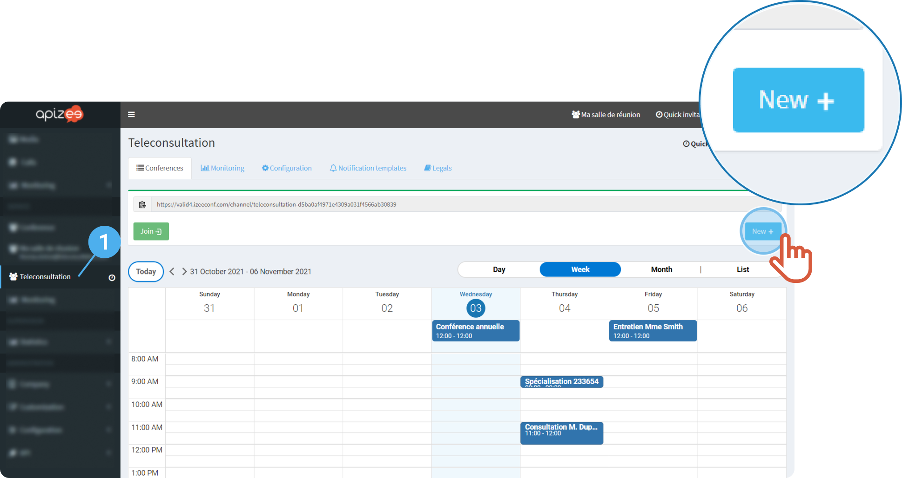
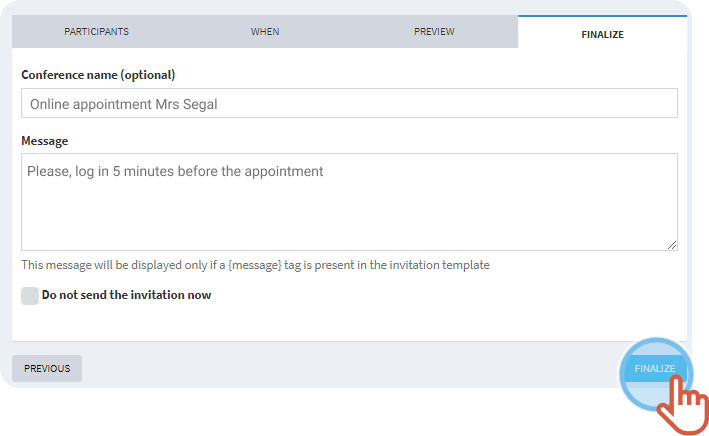
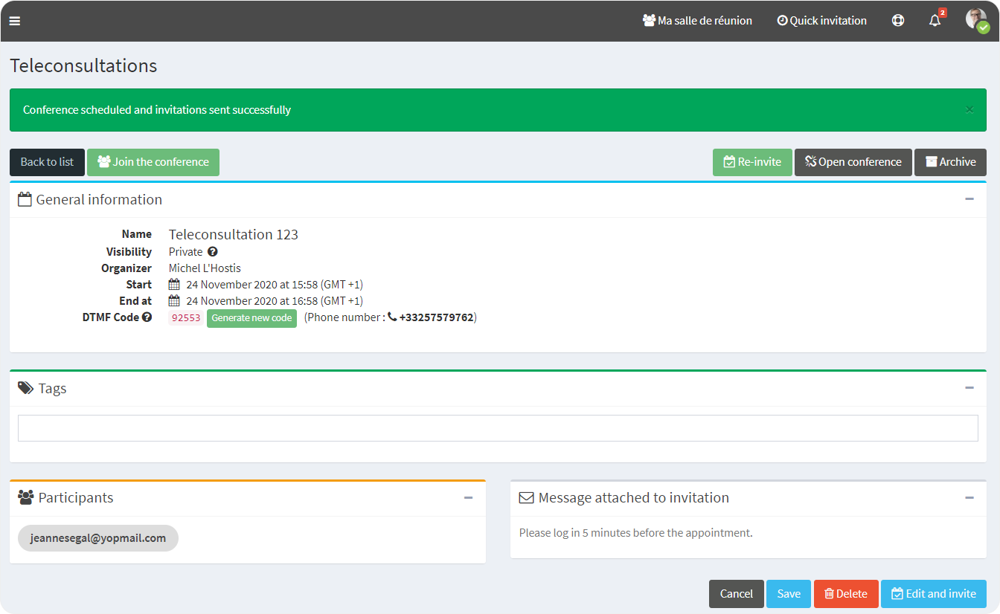
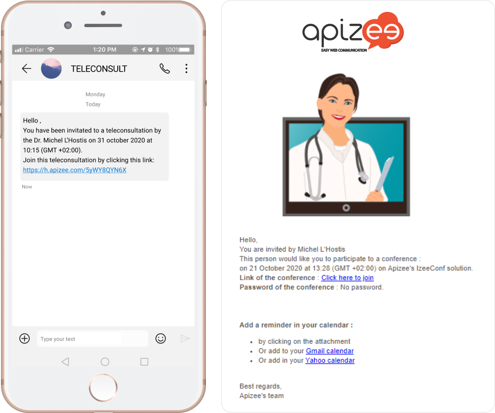


You are logged in to your account.


1. On the left-hand menu, click **Teleconsultation**.
2. Click **New**.
  

    

    To change the view mode, click **Day**, **Week**, **Month**or **List**.

    
 

    

    This window displays. The following steps may be different whether you are an organizer or an assistant:

    
    | **Organizer** | **Assistant** |
    | --- | --- |
    |  -  You are the one who runs the session.    -  Check that your name displays under the **Organizer** title.  -  Enter the guest email address (2), or type the name of someone who is in the **Directory **(2a or 2b).   -  Enter the phone number, if necessary.   -  Click **Next**.   |  -  You do not run the session.   -  You want to entrust the organization to someone else.    -  Click **Change organizer**&#160;(1) and enter the name of the organizer in the search bar (1a).   -  Enter the guest email address (2), or type the name of someone who is in the **Directory **(2a or 2b).   -  Enter the phone number, if necessary.   -  Click **Next**.   |

3. Select a **Duration**, a **Start time** and**End time** **Day** and **Hour**.
4. Choose a **Reminder**, if you want it.
5. Click **Next**. 
 
 
6. Select a **template**. 

    

    If you did not create your own template, select the default template.

    
    

    *See also**[Customize the notification templates](../configuration-on-the-apizee-portal/configure-the-teleconsultation/customize-the-notification-templates.md)

    
7. Select a **language**.
8. Click **Next.   **
9. Give a name to the teleconsultation , if you want it.
10. If you chose to send this invitation by email, add a personal message. 

    

    The message will display in the email.

    
 
11. Click **Finalize**. 

    

    The invitation is sent.

    
  

    

    The guest receives a message with a link to join the session.

    
 

* * *

**Watch the tutorial**

[More tutorials](../tutorials-health.md)
