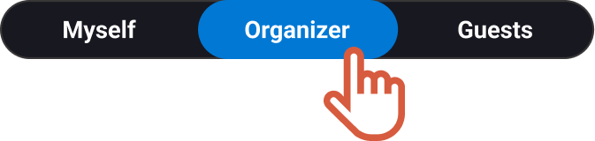
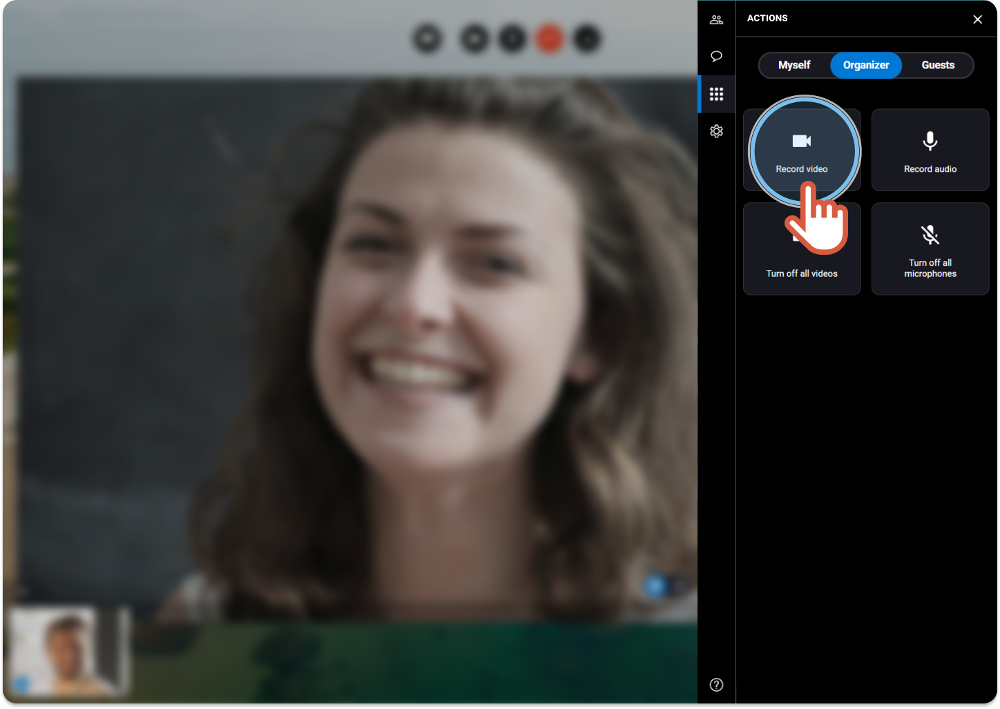
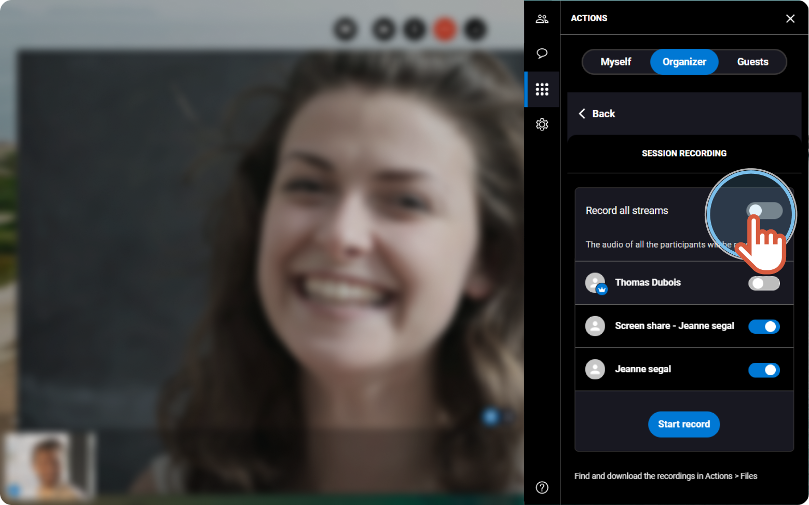


You are an organizer and you want to record the ongoing session.


1. On the right, click the **Actions** tab 
2. Click the **Organizer** tab. 
 
 
3. If you want to record the videos, click **Record video**. 
 
 
4. To choose what videos you want to record, deactivate **Record all streams**. 
 
 
5. Choose the videos and click **Start record**. 

    |  | The audio of all the participants will be recorded by default. |
    | --- | --- |
6. Click **Stop recording** when you are done. 

    |  | The recording is available on your Apizee account. |
    | --- | --- |

|  | **See also** [Download files - After the session in the portal](download-files.md) |
| --- | --- |
