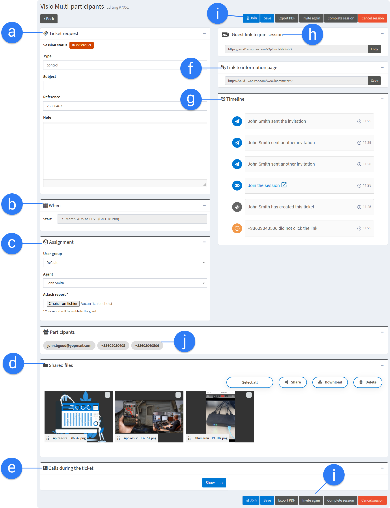

1. In the left-hand menu, click the service you want.
2. In the ticket list, find the ticket you want to follow up and click 


The page of the ticket displays. You can find the following information:


| a. | Ticket request | Information given when creating the ticket. | To edit the ticket information:
 -  Click in the fields to change the content then&#160;  -  Click **Save**.   |
| --- | --- | --- | --- |
| b. | When | Date and time set for the assistance. | If the scheduling option is activated, you can change an immediate appointment into a scheduled one and vice versa.
- Click **Immediate** or **Scheduled**.- Click **Save**.- Click **Invite again**.- Follow the steps on the screen to send a new invitation for the same assistance to your guest.



The guest receives a message with the new information.


| c. | Assignement |  -  Person in charge of the ticket.  -  Assistance report.   |  -  Click the **Assign to** drop-down menu to assign the ticket to another person.  -  Click **Choose File**&#160;to upload the assistance report.   



**See also** [Attach a report to the ticket](../video-assistance/agents/follow-up-the-assistances-on-the-portal/attach-a-report-to-the-ticket.md)


| d. | Shared files | Files shared during the assistance.
 

 -  Files opened in the whiteboard during the session  -  Files sent to the agent by the requester before or after the session  -  Pictures the agent took remotely  -  PDF of the session information if exported.
 <table class="seeAlso" cellspacing="0" cellpadding="0"> <tbody> <tr> <td class="seeAlsoImageCell "> </td> <td>  **See also&#160;**&#160;&#160;<a href="export-session-information-into-pdf.md" target="_top">Export the session information into a PDF</a>
 </td> </tr> </tbody>
</table>  | If you want to know more about the file geolocation and timestamp:
- Move your mouse over the file and click.

 The information displays

- If you want to share the file or download it, tick the box and click **Share **or **Download**. |  | **See also** [Share a file with the requester](../video-assistance/agents/actions-during-the-video-assistance/share-and-download-files/share-a-file-with-a-requester.md) 
**See also** [Download the files - After the session in the portal](../video-assistance/agents/actions-during-the-video-assistance/share-and-download-files/download-files-shared-during-assistance-session.md/a/h2__2077902823) |
| --- | --- |

**See also** [Share a file](../actions-during-the-assistance/share-file.md) & [Download files - After the session in the portal](../actions-during-the-assistance/download-files.md)

| e. | Calls during the ticket | Call details for this ticket:
 -  Sart/End   -  Duration   -  Caller (requester) / Called (agent)   -  Status of the call  -  Reason why the call ended   |  |
| f. | Link to information page | Information page URL.
 
This page shows all the information (pictures, videos,...) and the conversations shared during the assistance call. | Copy-paste this link in a new tab or in an email to share the ticket information:
 
 |
| h. | Guest link to join session | URL to join the video session as a guest. | Copy this link and send it to the guests so they can join the video session.
The same link is sent by message to the guests. |
| g. | Timeline | Real time timeline of the assistance |  -  Check the timeline to find out **where the guest is** in the different steps to join the assistance  - Retrieve the **events **of the assistance and the **time **it happened. - Quick **sum up** of the assistance 



**See also** [What is the Timeline for?](../video-assistance/agents/follow-up-the-assistances-on-the-portal/what-is-timeline-for.md)


| i. | Buttons for several actions | -   Join the session  -  Save your changes -  Download the information into PDF format -  Reinvite the guest -  Change the ticket status  | - Choose to directly **join** the video session or <a href="receive-an-incoming-assistance-call.md" target="_blank">wait for the guest to call you</a>.- **Save** the edited information added in the **Ticket request** part.- Need to retrieve the assistance information? <a href="https://doc.apizee.com/smart/project-diag-help-desk/export-session-information-into-pdf" target="_blank">Export into a PDF file</a>.- Click **Invite again** to&#160;add, delete or change the guests contact. You can also&#160;<a href="https://doc.apizee.com/smart/project-diag-help-desk/send-new-invitation-for-same-session" target="_blank">send a new invitation</a> to this assistance. The guests will receive a new invitation message with the link to join the session.- Change the session status, click:<li>**Complete session**. If needed the agent can still reinvite the guest.- **<a href="https://doc.apizee.com/smart/project-diag-help-desk/cancel-a-session" target="_blank">Cancel session</a>**- **Close session**- **Delete session**. Once deleted, the session disappears.<table class="seeAlso" cellspacing="0" cellpadding="0"> <tbody> <tr> <td class="seeAlsoImageCell "> </td> <td>  **See also&#160;**&#160;<a href="https://doc.apizee.com/smart/project-diag-help-desk/video-assistance-ticket-status" target="_blank">What status for my ticket?</a> 
 </td> </tr> </tbody>
</table></li> |
| j. | Participants | Contact of the guests invited to the session. |  |
