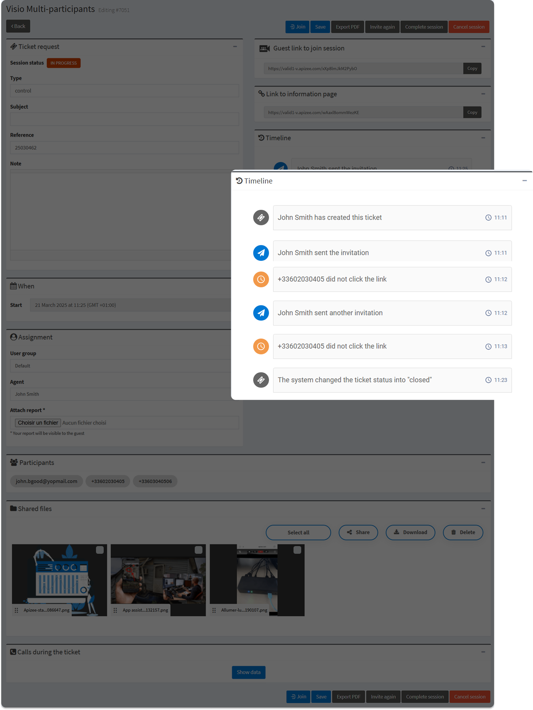
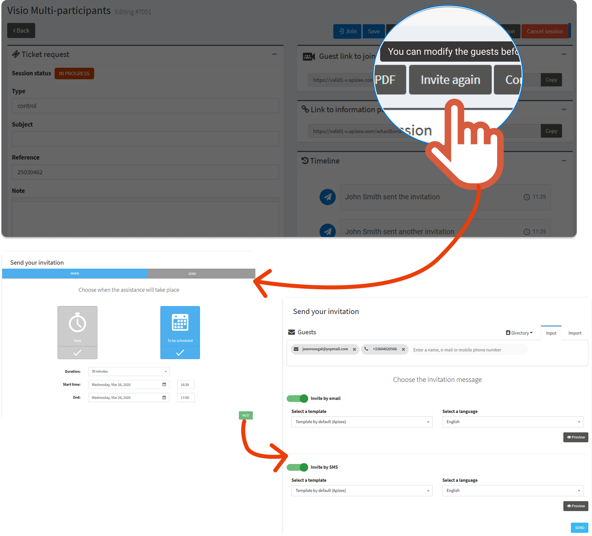

#  Real-time timeline of the session.


You are an agent and you need to:
  - understand **in which step your interlocutor ****is **to join the video assistance  - **retrieve some events** of the video assistance  - have a **quick sum up** of what happened during the video assistance  


1. In the left-hand menu, click the service you want.
2. In the ticket list, find the ticket you want to follow up and click 


The assistance page displays.

 
3. On the right hand side, under **Timeline**, check the different events.

| Event | Event | Explanation | Event ID\* |
| --- | --- | --- | --- |
|  | Session created | An agent or a supervisor [created a ticket](../video-assistance/agents/start-a-video-assistance/create-a-ticket-send-an-invitation/create-a-ticket-common-invitation.md). | 12 |
|  | Assistance assigned to someone | The assistance has been assigned to an agent [during the creation](../video-assistance/agents/start-a-video-assistance/create-a-ticket-send-an-invitation/create-a-ticket-common-invitation.md/a/assign-assistance-ticket-creation), or [after](../video-assistance/agents/follow-up-the-assistances-on-the-portal/follow-a-ticket.md/a/assigne-assistance-follow-ticket). | 13 |
|  | Invitation sent | The invitation to an assistance has been sent after the ticket creation. | 4 |
|  | Invitation link not clicked | The guest did not click the link in the assistance invitation.

 | 27 |

Invitation declined | |  | For **scheduled** assistance only.

The guest clicked the **More information** link in the invitation, then, **declined** the invitation. 
The agent can still invite the guest again on another date and time that suits best.

 | 5 |

Invitation accepted | |  | For **scheduled** assistance only.

The guest **accepted** the invitation to the assistance.

 | 6 |

Priority of the session changed into "scheduled" | |  | [Scheduling](../video-assistance/admins/configuration-on-the-apizee-portal/configure-the-video-assistance/customize-the-tickets.md/a/schedule-feature-description) option has to be activated.

The video assistance was immediate and has been changed to be scheduled on another moment. | 18 |
|  | Appointment canceled | The agent [canceled the video assistance appointment](../video-assistance/agents/follow-up-the-assistances-on-the-portal/cancel-a-session.md).

 | 37 |
|  | Another invitation sent | The agent [sent a new invitation](../video-assistance/agents/follow-up-the-assistances-on-the-portal/send-new-invitation-for-same-session.md) to the guest for the same assistance.

  | 35 |
|  | Session can start | The page of the link displays on the guest screen now.

 | 10 |
|  | Agent completed the assistance | The agent clicked **Complete session** in the assistance page.

 | 11 |
|  | System changed the session status into "completed" | The status of the session automatically changed into "completed" because the **[End transfer notification delay (min)](../video-assistance/admins/configuration-on-the-apizee-portal/configure-the-video-assistance/customize-the-tickets.md/a/end-transfer-notification-delay)** trigger is exceeded.


**See also** [Configure the triggers](../video-assistance/agents/follow-up-the-assistances-on-the-portal/attach-a-report-to-the-ticket.md)


**See also** [What status for my ticket?](../video-assistance/agents/follow-up-the-assistances-on-the-portal/video-assistance-ticket-status.md)

|  | Agent closed this session | The agent clicked **Close session** in the assistance page.

 | 8 |
|  | The system changed the session status into “closed” | The status of the session automatically changed into "closed" because the **[Max expiration time (min)](../video-assistance/admins/configuration-on-the-apizee-portal/configure-the-video-assistance/customize-the-tickets.md/a/max-expiration-time)** trigger is exceeded.


**See also**https://doc.apizee.com/articles/project-diag-help-desk-diagnostic-center/attach-a-report-to-the-ticket[Configure the triggers](../video-assistance/admins/configuration-on-the-apizee-portal/configure-the-video-assistance/customize-the-tickets.md)


**See also**https://doc.apizee.com/articles/project-diag-help-desk-diagnostic-center/attach-a-report-to-the-ticket[What status for my ticket?](../video-assistance/agents/follow-up-the-assistances-on-the-portal/video-assistance-ticket-status.md)



\* **Event ID** is only for users who use the APIs.

