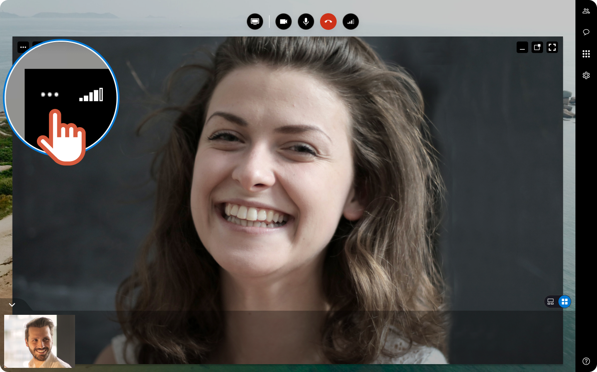
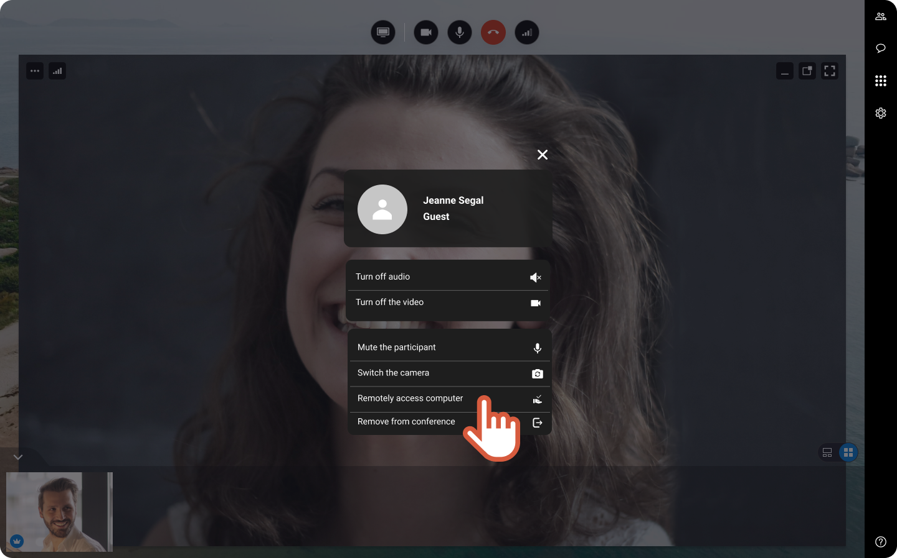
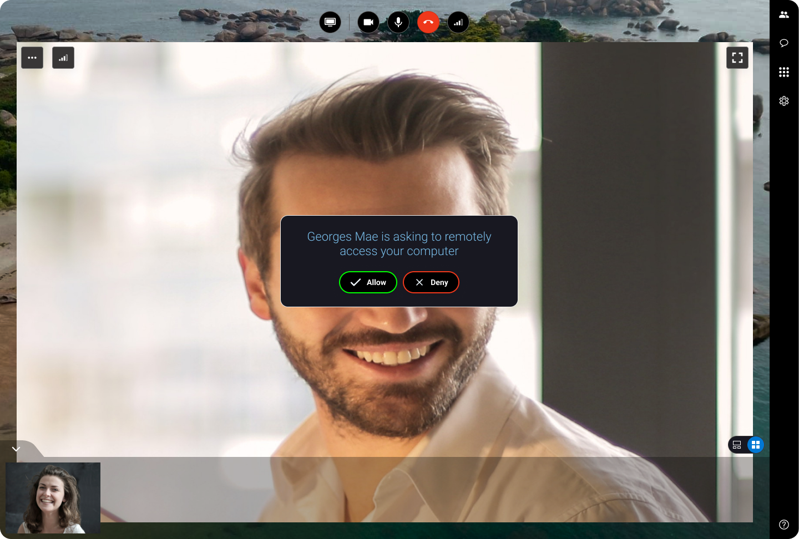
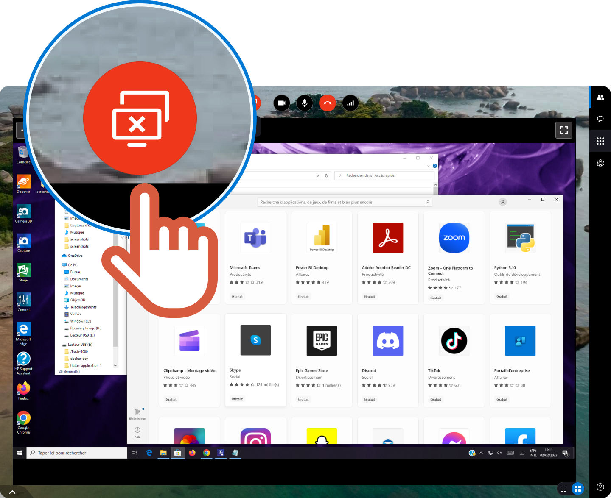

1. On the top left of the participant video, click  
 
 
2. In the list, click **Remotely access computer**. 
 
  

    

    An invitation is sent to the participant and displays on his screen as follow:

    
 **Guest screen  **    

    |  | When accepted, the guest needs to share the screen and install an application software.
 
Once the software is launched, the remote access starts. You can control the participant keyboard and mouse. |
    | --- | --- |

    

    If you want to know the steps that the guest will have to follow before the organizer takes remotely control of the computer, check the followong article:  ***

    
3. When you are done, click  
 
  

    

    The remote access stops. The organizer cannot control the guest's keyboard and mouse anymore.

    