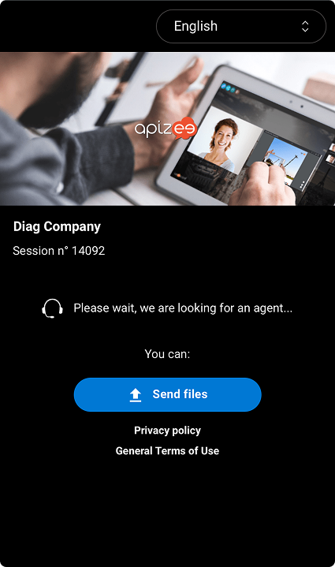
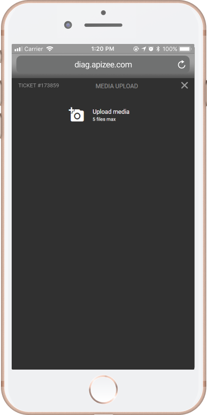
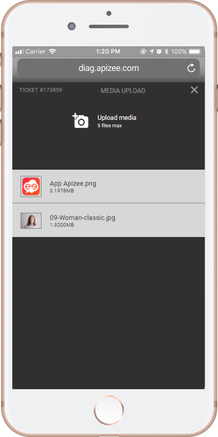
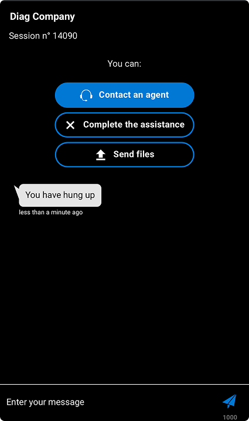
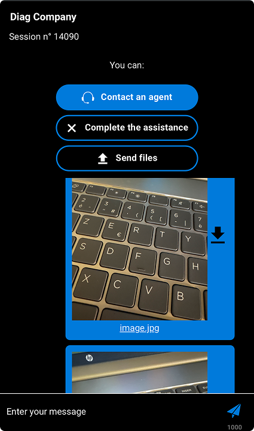

# Share files:

* [Before a call](share-file-with-an-agent.md)
* [During the assistance call](share-file-with-an-agent.md)
* [After a call](share-file-with-an-agent.md)

## Before a call

You can send files to an agent even if the agent is unavailable.

1. Click **Send files** to transfer files.

2. Click **Transfer files** and choose the documents you want to share.


The agent receives the documents.
 If you sent a picture, you can see a preview.


## During the assistance call

1. If you want to send a picture to the agent with your mobile camera, click 

    |  | Your mobile phone camera opens. |
    | --- | --- |
2. Take a picture then, click **OK**.
3. Allow to share your geolocation.

    |  | The file charges and displays in the **Messages** tab. |
    | --- | --- |

## After a call

1. From the assistance page, click **Send files**.

2. Choose your document and click **Open**.

    |  | The document charges. |
    | --- | --- |

    |  | The document displays in the messages. |
    | --- | --- |


You can keep sending files to the agent as long as the ticket is open.


* * *

**Watch the tutorial**

[More tutorials](../../tutorials.md)
