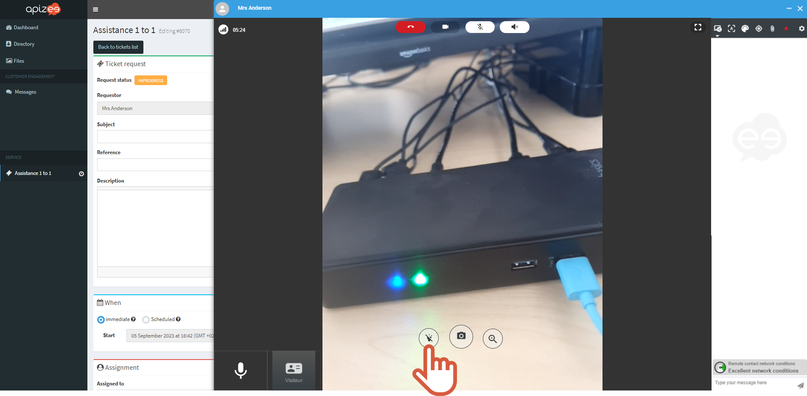
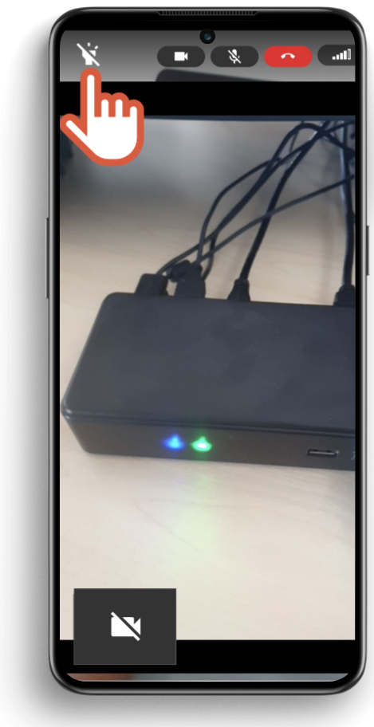

|  | Available only if the participant is following the session with:
  -   an **Android smartphone**.  -  the **back camera** selected.  -  on **Chrome** web browser.   |
| --- | --- |


You are the organizer of the session and you cannot see clearly what the participant is showing to you. 
You want to help the participant to turn on the flashlight on the back of his phone.



Turning the flashlight on is unvailable while recording the session.


1. Mouve your mouse on the guest video.
2. Click  
 
  

    

    The flashlight of the guest mobile phone is on.

    
3. To turn the light off, click 


The **guest** can also turn the flashlight on by himself. Tell him to tap on the **flashlight button** in the upper left corner of the screen.


 
