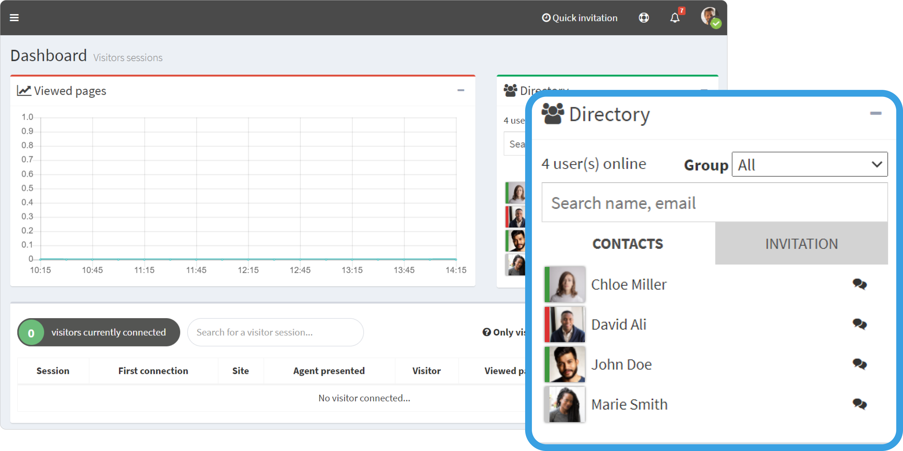
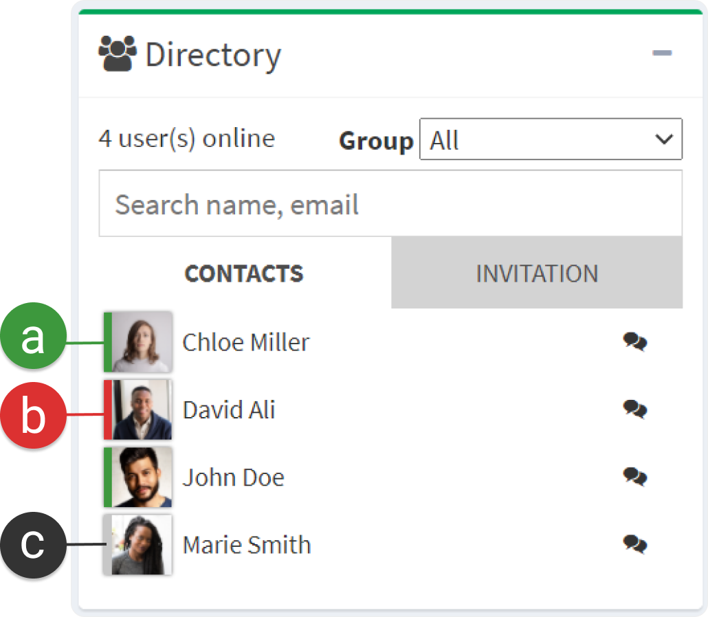
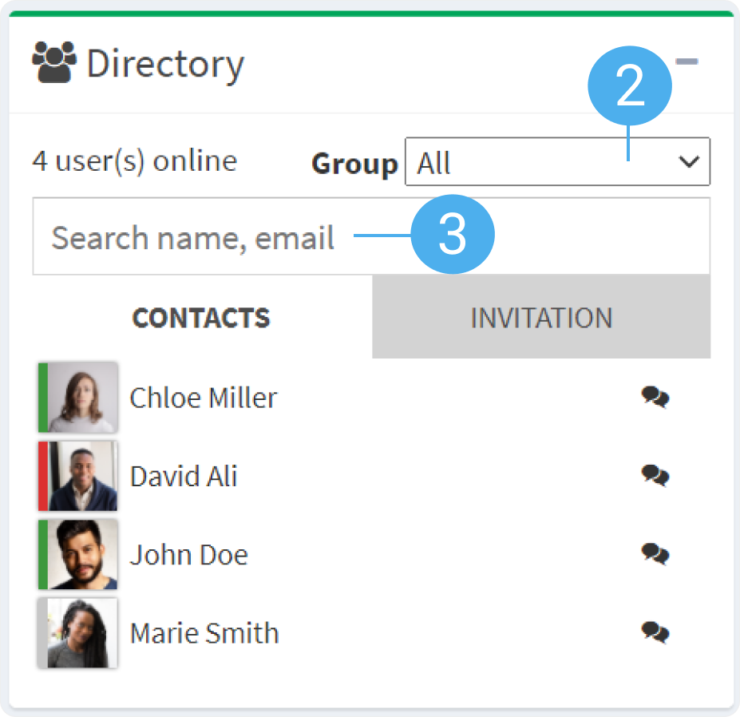
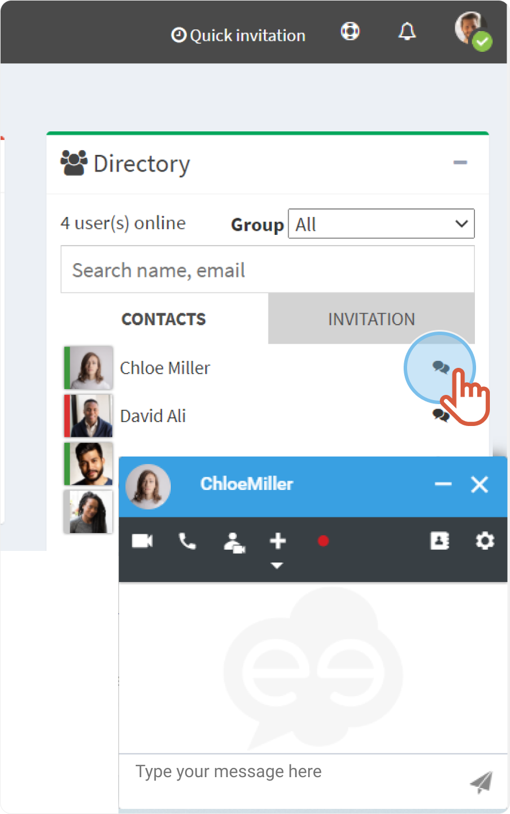
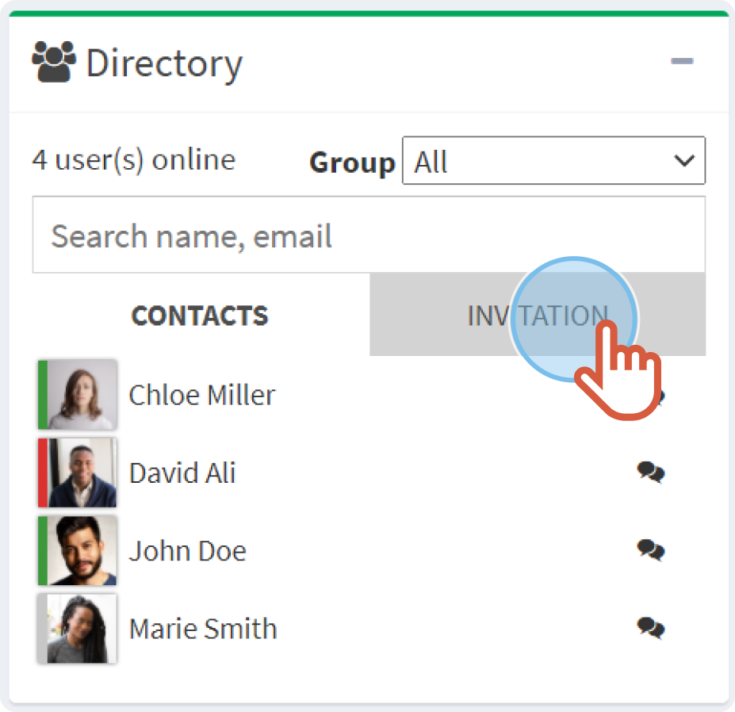
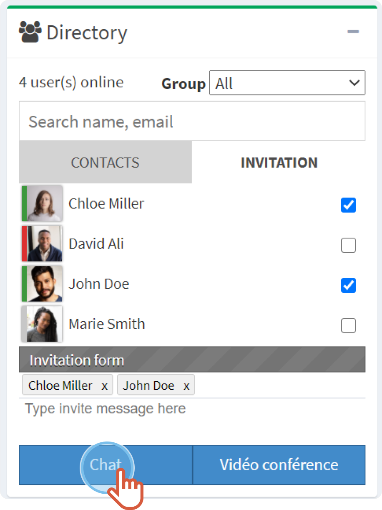
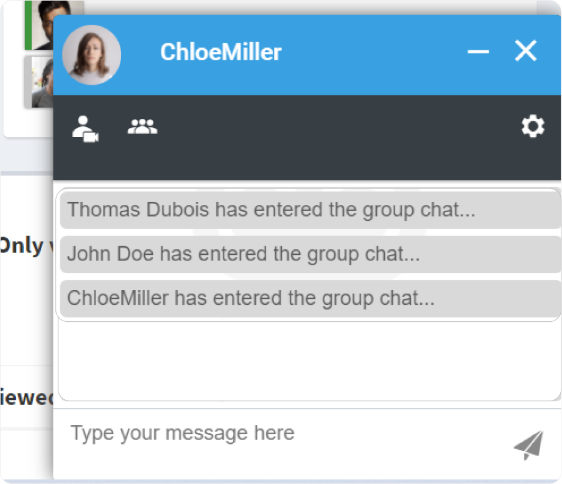

#  Create a conversation with a single person

1. On the portal dashboard, find your company **Directory**. 


The contacts display.


    | a. | Available |
    | --- | --- |
    | b. | Busy |
    | c. | Unavailable |
2. Filter the list by **group**. 
The groups are those created by the company administrator according the skills of each agent. 


**See also** [Configure the agents](../configuration-on-the-apizee-portal/configure-the-agents.md)

3. Search a contact in the **search** **bar** with a name or an email address. 

4. Click a contact thumbnail to open the conversation window. 

5. Share messages.
6. Click **Video** call or **Audio** call only to start a call. 


The call starts.


# Create a group conversation

1. In the **Directory**, click **Invitation**.

2. Tick the **box** of the contacts you want to include in the conversation.
3. Click **Chat**.


The conversation window opens at the bottom of your screen.


