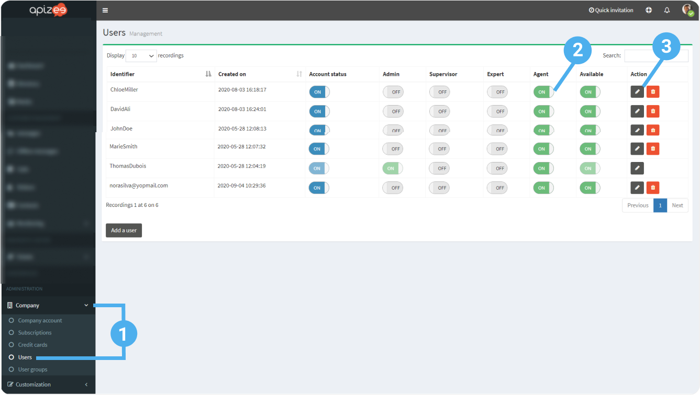
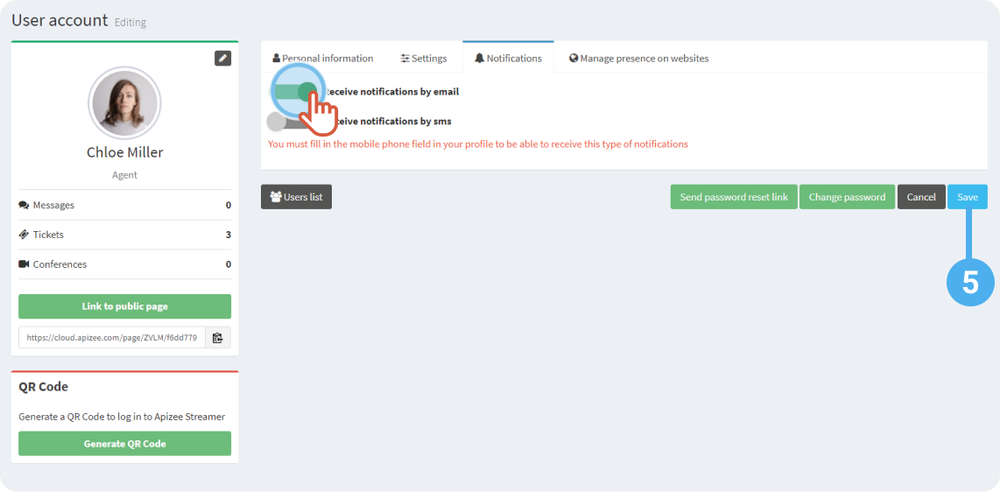
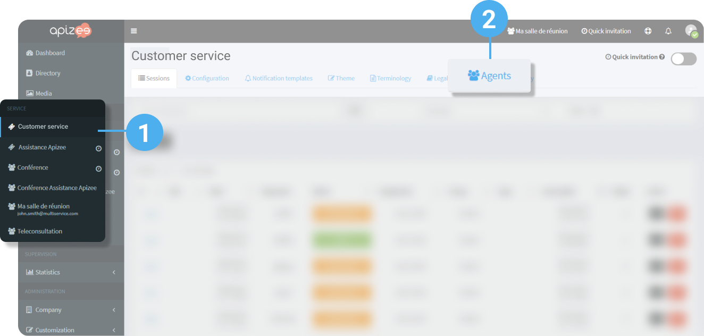
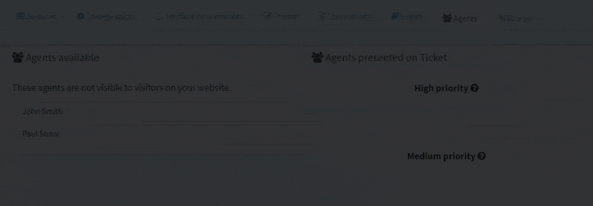
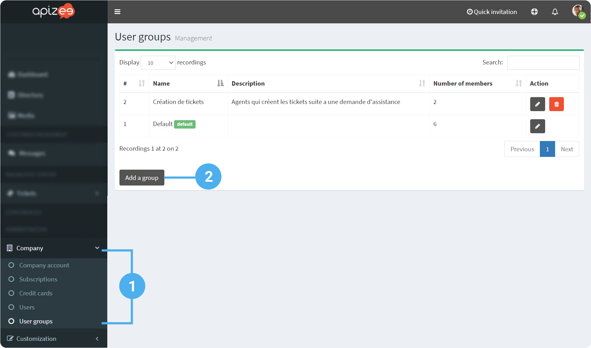
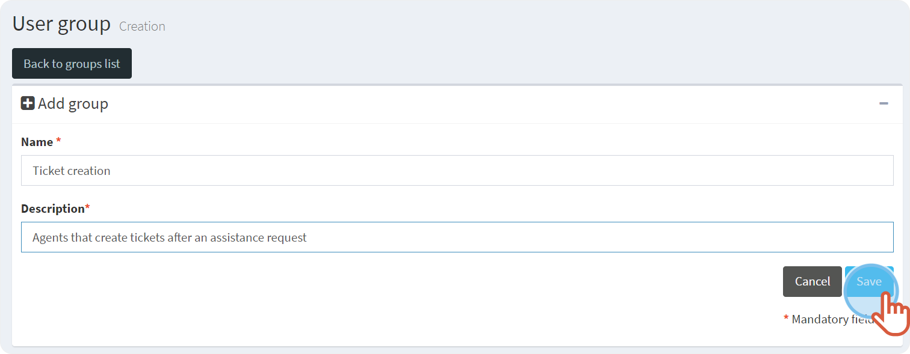
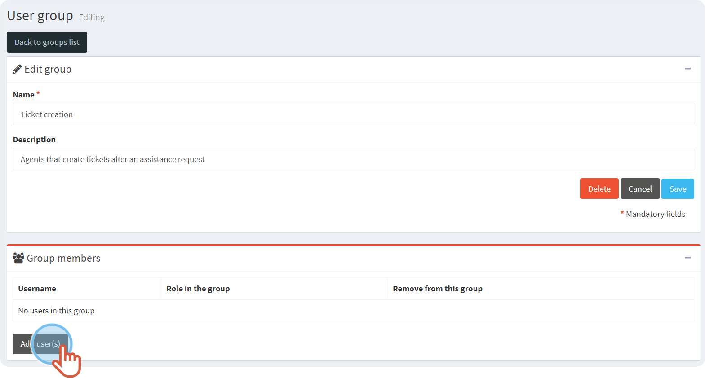
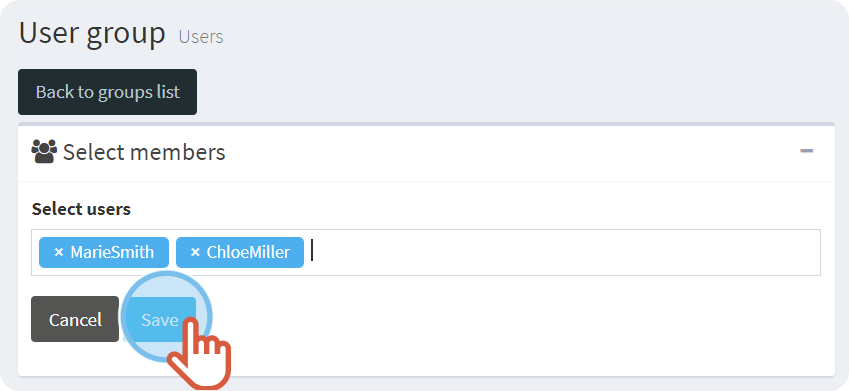
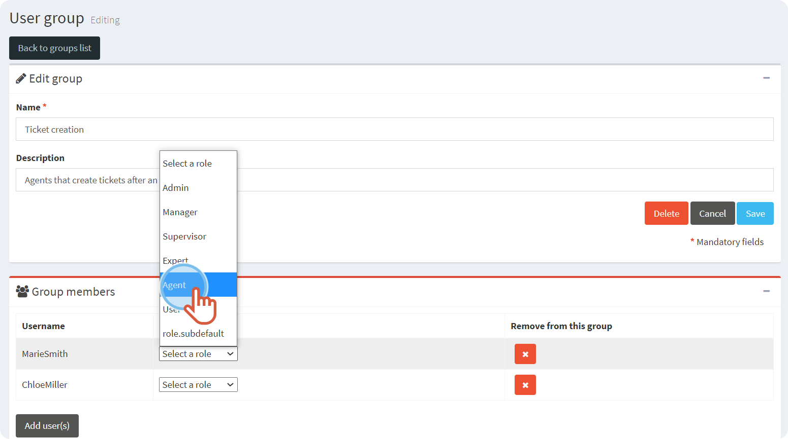

# Define the role, create a group and set the user availability

* [Define a user role and activate the notifications](configure-the-agents.md#define-a-user-role-and-activate-the-notifications)
* [Prioritize the user availability](configure-the-agents.md#prioritize-the-user-availability)
* [Create a user group](configure-the-agents.md#create-a-user-group)

##  Define a user role and activate the notifications

1. In the left-hand menu, click **Company**then, **Users**.
2. Click the **Switch** button to activate the **role** you want to assign to someone.
3. Click to access the user account then, click the **Notifications** tab. 
 
 
4. Click the **Switch** button to receive the notifications:
    * by email 
and/or
    * by SMS
5. Click **Save**. 
 
 


Fill your email address and/or your phone number in the Personal information tab to achieve the activation of the notifications.


## Prioritize the user availability


To enjoy this feature, you need to activate **[Call distribution mode - Agents availability according to the priority order](configure-the-video-assistance/customize-the-tickets.md#call-distribution-mode)**


Set up a priority order in the user’s availability.
 
This feature allows to switch a ticket/session to another available agent if the agent originally assigned to the ticket/session is not available.
 
The call is directed first to the agents categorized in the high priority, then if they are not available, to the ones in medium, normal and finally, in low priority.

1. In the left-hand menu, click the service for which you want to configure the priority of the agents.
2. Click the **Agents** tab.

3. In the left-hand side, drag and drop the name of the user to the right, under the level of priority that you want.


The configuration is automatically saved.

## Create a user group

Each user belongs to one (the **default**one) or several groups.

The users can be grouped according to their skills, their roles or any other characteristics that you define.

1. In the left-hand menu, click **Company**then, click **User groups**.
2. Click **Add a group**.

3. Choose a name and write a short description of the group characteristics.
4. Click **Save**.

5. Click **Add users**.

6. Choose the users that will take part of the group.
7. Click **Save**.

8. In the drop-down menu, select the role of each user in the group.



**See also** [Communicate with my coworkers:find someone in the directory thanks to "Group filter"](../communicate-with-my-coworkers/communicate-colleagues-send-a-common-invitation.md)

