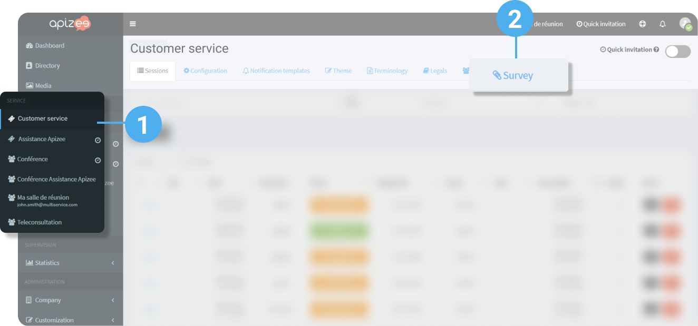
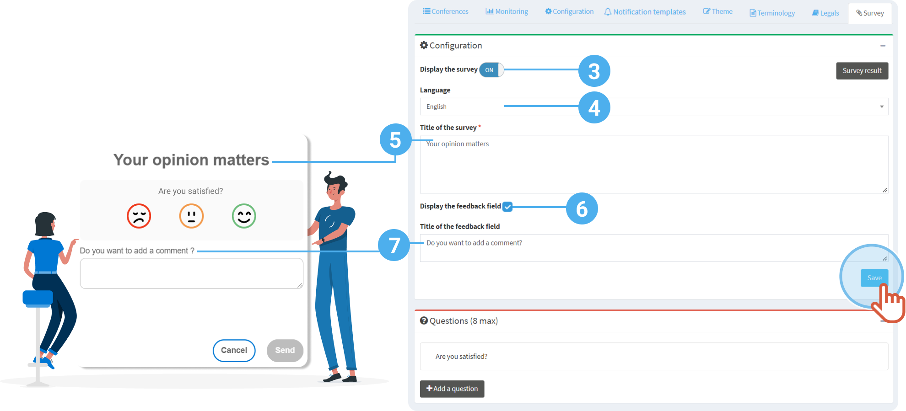
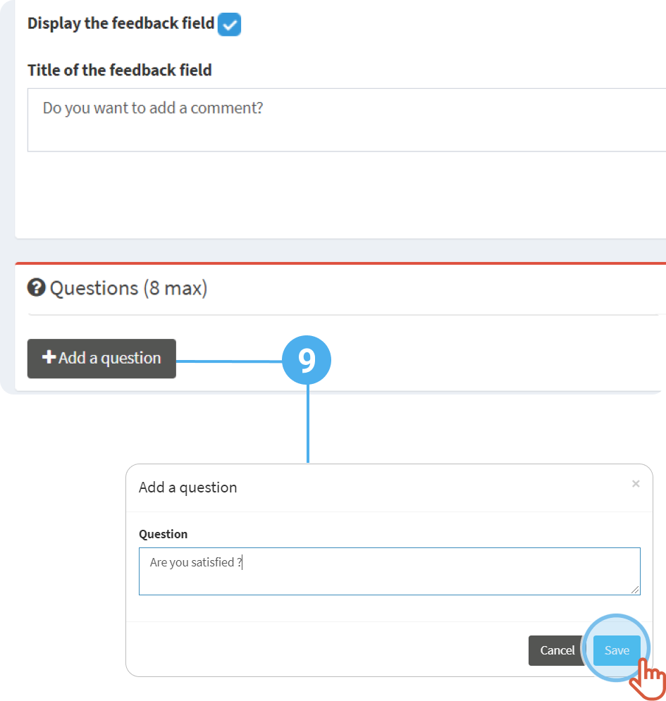

1. In the left-hand menu, click the service for which you want to configure the satisfaction survey.
2. Click the **Survey** tab. 
 
 
3. Click the switch to **Display the survey**.
4. Choose the **language** of the survey.
5. Add a **Title**. 
It will display as a title on the top of the survey.
6. If you want to let the requester add a comment, tick the box **Display the feedback field**.
7. Write the title that will display on the top of the comment.
8. Click **Save**. 
 
9. Click **Add a question**. 
You can add up to 8 questions.
10. Click **Save**. 
 
 


The survey is activated.



**See also** [Respond to the satisfaction survey](../../respond-to-the-satisfaction-survey.md)
