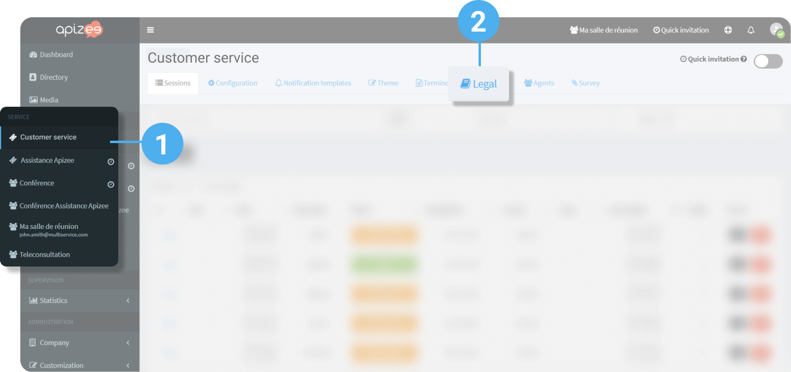
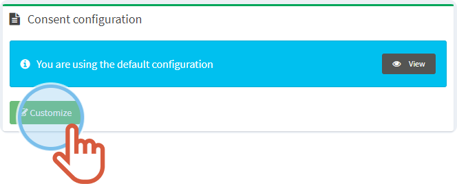
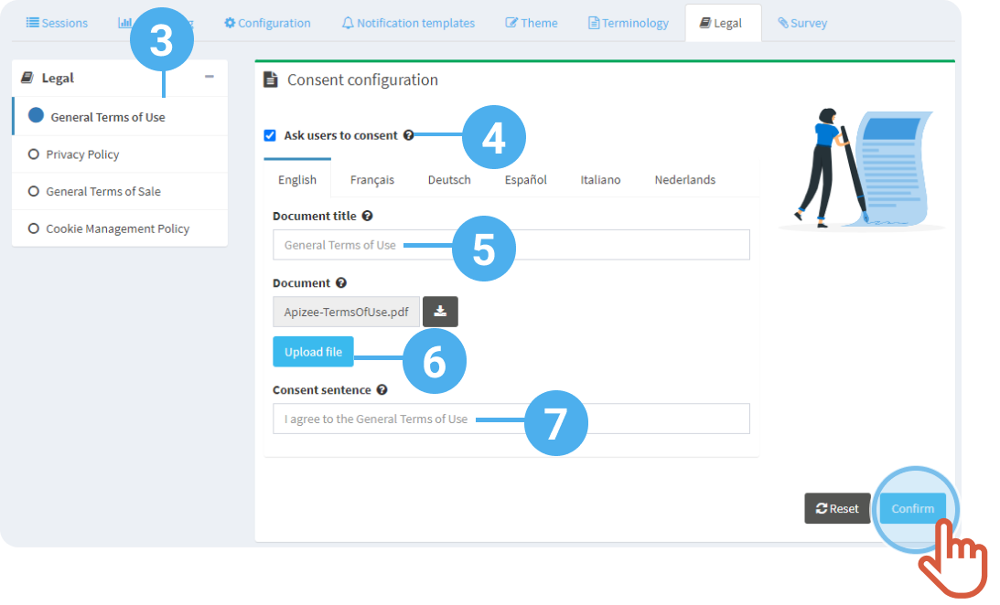
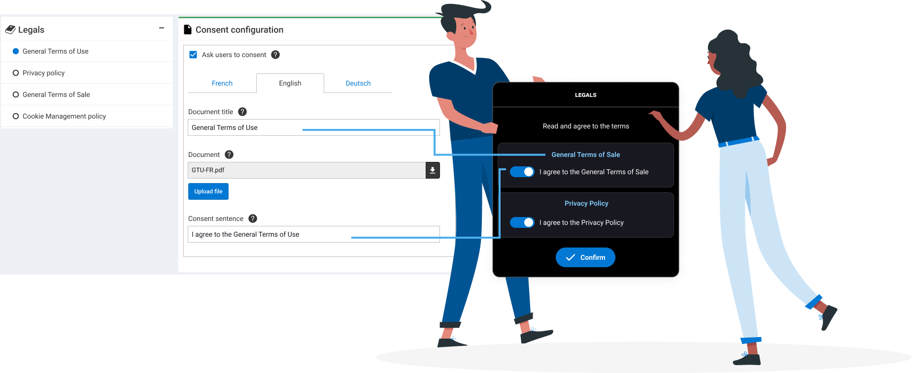

1. In the left-hand menu, click the service for which you want to configure the consent.
2. Click the **Legal** tab. 

|  | If you did not customize the legal documents yet, then, the default documents are displayed.   Click **Customize**. |
    | --- | --- |

3. In the list on the left, choose the type of consent you want.
4. Tick the box **Ask users to consent** if you want the user to see the consent window before accessing to the service.
5. Enter the **name of the legal document** that appears in the consent window.
6. **Upload** the legal document that the user can download.
7. Enter the **consent sentence** that the user need to confirm to agree to the terms.
8. Click **Save**.


If you changed your mind and want to come back to the [default documents](configure-the-consent.md#info-default-documents), click **Reset** .



The consent configuration is saved and displays on the user interface.



**See also** [Receive an assistance invitation & call an agent](../../start-a-video-assistance/receive-an-assistance-invitation-and-call-an-agent.md)
