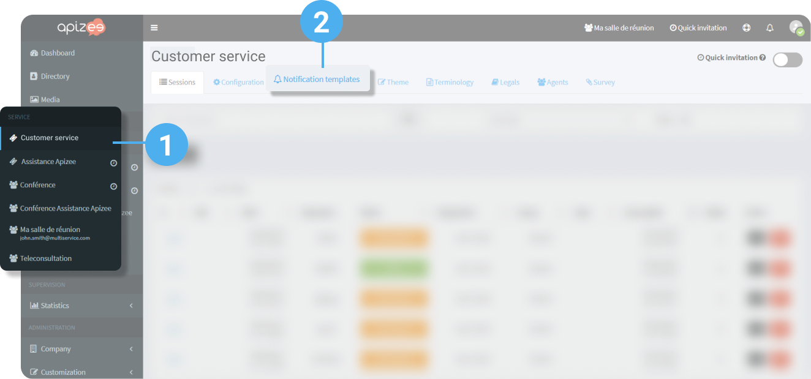
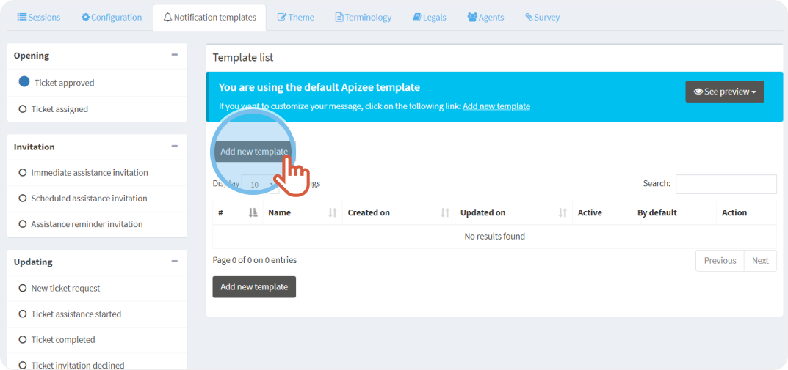
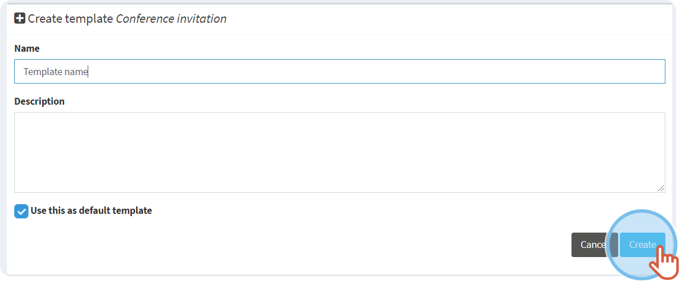
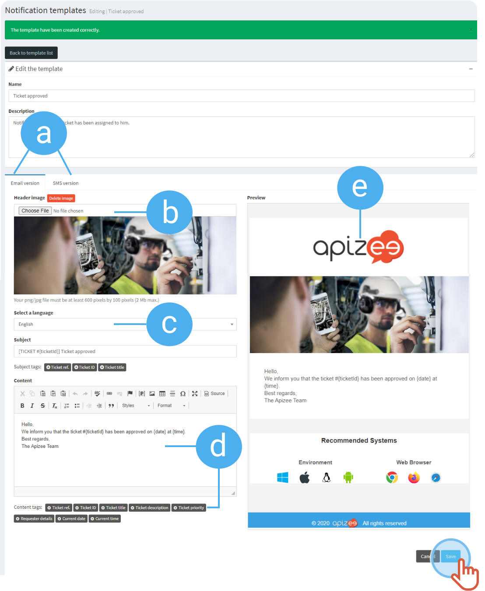
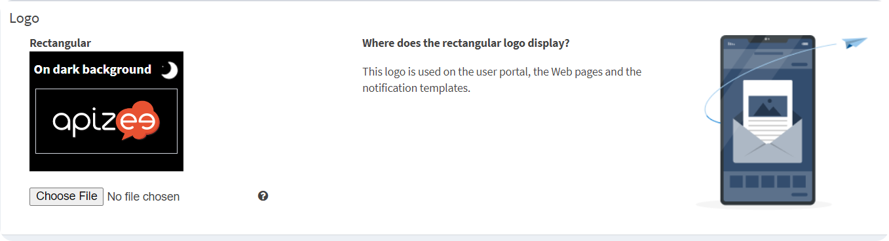

1. In the left-hand menu, click the service for which you want to customize the templates.
2. Click the **Notification templates** tab.
 

3. In the list on the left, choose the notification template you want to customize. 

    |  | Choose whether you want to **edit**the template or**Add a new one**.
 
We recommend to **Add a new template**, and define it as a default template. 
 So, you can keep the current one as an example. |
    | --- | --- |
4. Click **Add new template**. 
 
 
5. Enter a name and write a short description.
6. Click **Create**. 
 
 
7. Customize the template and click **Save**. 
 
 

| a. | Choose if you want to customize the **email** or **SMS** version.
 * One SMS = 160 characters. Beyond this number, the message is divided into several SMS.
 

 


Avoid special characters as they increase the number of SMS.  - Here is an example of special characters: | ^ € { } [ ] ~  - French special characters that reduce the SMS length to 70 characters: &#226;, &#234;, &#238;, &#244;, &#251;, &#231;, œ

| --- | --- |
| b. | Choose a new picture that displays as a header in the message. |
| c. | Choose the language of the notification template. |
| d. | Write the content you want in the notification. 
Insert **Tags**to add specific information about the session.
 


Move the mouse over the tag for more information about what it displays.

-  **Ticket ref.**: ticket reference given by the company when the ticket is created.  -  **Ticket ID**: ID or ticket number.  -  **Ticket title**: title given by the requester when he fills the assistance request form or the title given by the agent when the ticket is created.  -  **Ticket description**: description given by the requester when he fills the assistance request form or the title given by the agent when the ticket is created.  -  **Ticket priority**: the priority given by the company supervisor.  -  **Requester details**: information given by the requester in the assistance request form.  -  **Current date**: date of the current day.  -  **Current time**: hour at the time of the action.   |
| e. | This logo is customizable under the name of **Rectangular logo**:
 

 -  in the Company graphic theme, that is used as the default theme. 
 -  in the service Theme tab if you want to customize this logo for a specific service.   

    


**See also** attach-a-report-to-the-ticket.md[Customize the interface](../customize-interface/README.md)

