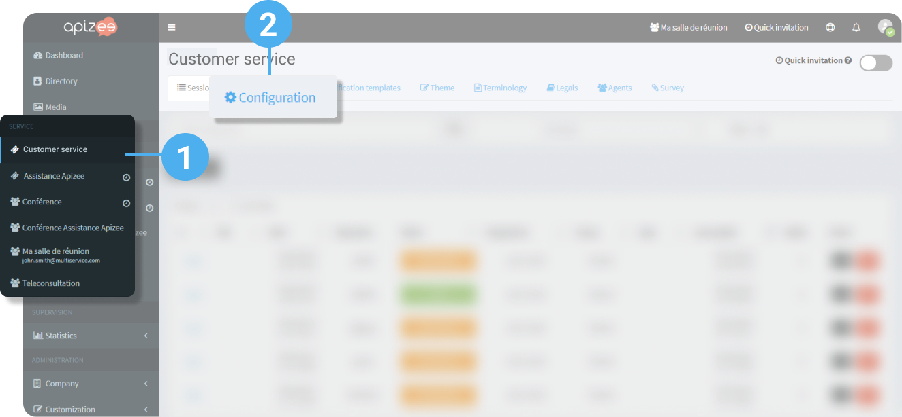
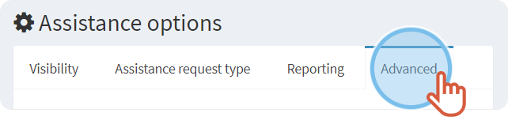
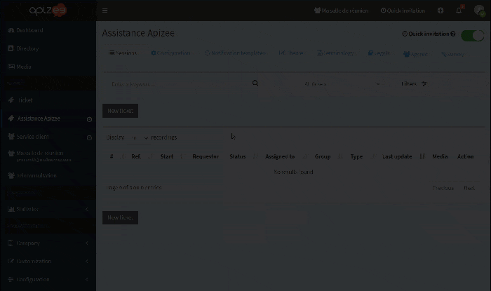
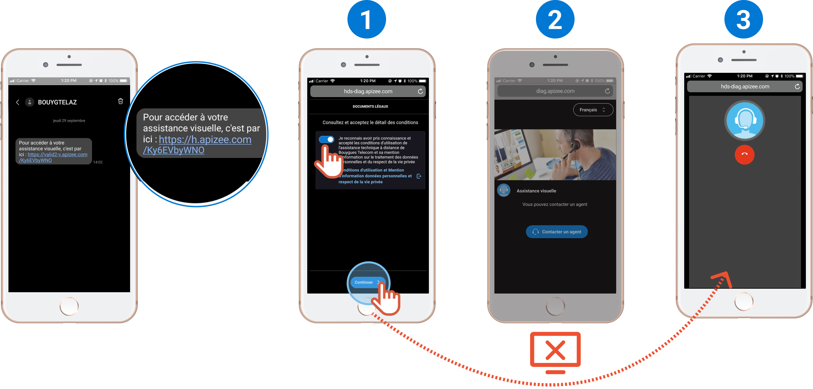


You are an administrator.


1. In the left-hand menu, click the assistance service type for which you want to configure the options. 

    

    The assistance services have this pictogram before their name: 

    
2. Click the **Configuration** tab. 
 
 
3. Under **Assistance options**, click **Advanced** tab. 
 
 
4. Click the **switch** button to activate or deactivate the features. 
 
 
5. Click **Save**. 
 
 

| Name | Explanation |
| --- | --- |
| Use contact form | When creating the ticket, possibility to create a contact form that can be modified in the ticket follow-up page. |
| Use type field | When creating the ticket, display or not the **Type** field that describes more precisely the assistance category (accident, incident, immobilized plane). |
| Use email subject field | When creating the ticket, possibility to add the subject of the requester request (very short description). |
| Use description field | Describe the reason why the requester needs assistance. Can be modified in the ticket follow-up page. |
| Enable schedule | When creating the ticket, possibility to schedule an assistance appointment with a date, hour and an invitation reminder. |
| SMS invitation | When creating the ticket, possibility to add the requester phone number. |
| Email invitation | When creating the ticket, possibility to add the requester email address (default configuration). |
| Multi call ticket | The requester can call the agent as many times as he wants after the first call as long as the ticket is not **Done**. |
| Test network automatically before call | The quality of the requester network is tested before entering into communication with him. The test results appear in the agent conversation box only when the results are bad.
 
The test is visible for the agent only. |
| Join the assistance session with a QR Code | The requester can join the session with another device (smart glasses for example) just by scanning a QR Code.

 



 

This option is not available if [Quickly join the session](customize-the-tickets.md#quickly-join-session) is activated.

 


| Join without microphone | Enter the assistance session without audio (micro muted for the agent and the requester). |
| Agent joins without camera | The agent will join the session without camera. It is possible to activate it during the session. |
| Quickly join the session | Usually, when the requester clicks on the link in the assistance invitation message, a window opens with: -   The legal terms to accept then,  -  a new window displays with a button&#160;**Call an agent**.  -  Once the button is clicked, the call starts.   
If this feature is activated, the requester directly calls the agent from the legal terms page. Step 2 is skipped.
 
 |
| Take a picture with the mobile camera | During an ongoing assistance session, the requester can take pictures with the camera of their device instead of taking a snapshot.
 
The picture that was taken displays in the messages.
 
The picture taken with the mobile camera has a better quality than a remote snapshot that could have been taken by the agent.
 


 

This feature is available on mobile phone and tablet only.
 


| Change status to **Expired** | If the requester does not click on the link in the assistance invitation message, then the ticket is **Expired**.
 
The agent still can invite the requester again if the expiration time is over 0. |
| Change status to **Closed** after expiration | If the requester does not click on the link in the assistance invitation message by the end of the indicated time, the ticket status changes into **Closed**. |
| Max acknowledgment time | Agent idle time after which a notification is sent to the supervisor (the invitation expired and the agent did not send an invitation or change the ticket status). |
| Change status to Completed | Timer beyond which the file transfer is unavailable. 
 If you send a picture at the end of 4 minutes, then the clock is postponed by 5 more minutes if you indicated 5 minutes in this box.

Regardless the file transfer, this timer also starts when a participant hangs up the video assistance.

When this timer is exceeded, the assistance status changes into **Completed** (**Done**). |
| Scan the guest video | Add a button in the Agent box in order to [scan the guest video](../../actions-during-the-video-assistance/scan-the-guest-video.md) and retrieve some written information. |
| Ask for geolocation | Ask the requester to allow to share his location.-  When the assistance starts
or -  When the agent takes a picture  |
| Call distribution mode |  -  **Agent assigned to the ticket only**:  If the agent assigned to the ticket is unavailable, the requestor cannot call him and have to wait until the agent is available.  -  **All agents which status is “Available”**: 
If the agent assigned to the ticket is unavailable, the call is transferred to another available agent.  -  **Agents availability according to the priority order**: 
The call is directed first to the agents categorized in the high priority, then if they are not available, to the ones in medium, normal and finally, in low priority. 
 <table class="infoBox" cellpadding="0" cellspacing="0"> <tbody> <tr> <td class="infoBoxImageCell ">  </td> <td class="infoBoxText ">If you want this distribution mode, the priority has to be set in the&#160;**Agents**&#160;tab.</td> </tr> </tbody> </table> <table class="seeAlso" cellspacing="0" cellpadding="0"> <tbody> <tr> <td class="seeAlsoImageCell ">  </td> <td>  **See also**&#160;<a href="configure-the-agents.md#configure-user-availability" target="_blank">Configure the agents and user availability</a> 
 </td> </tr> </tbody> </table>   |
