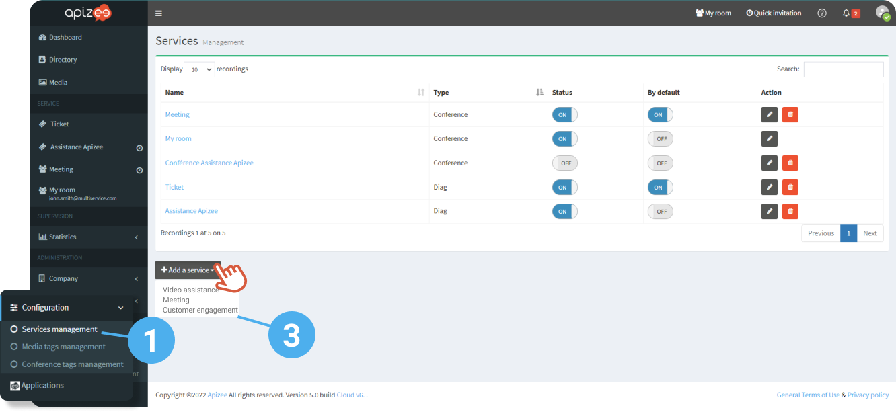
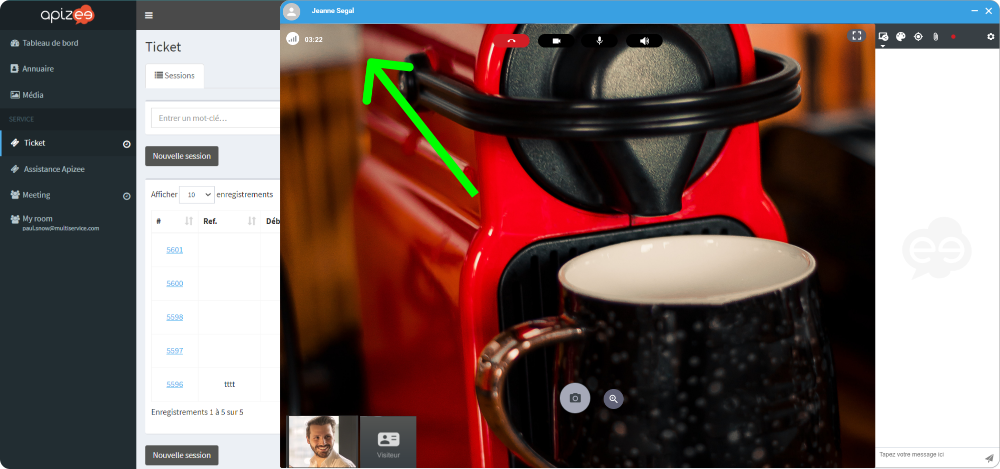
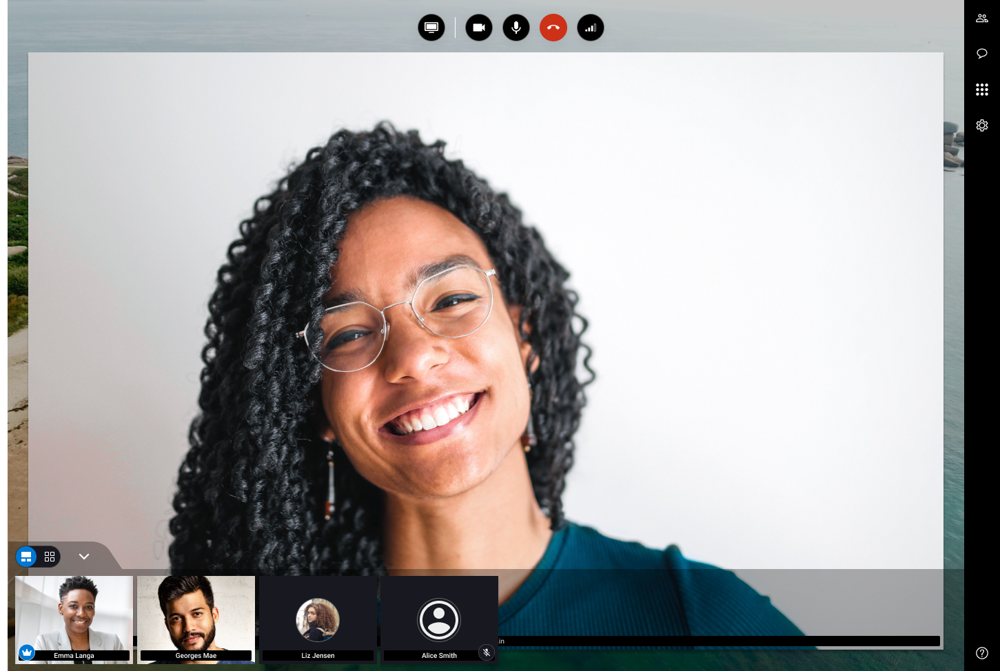
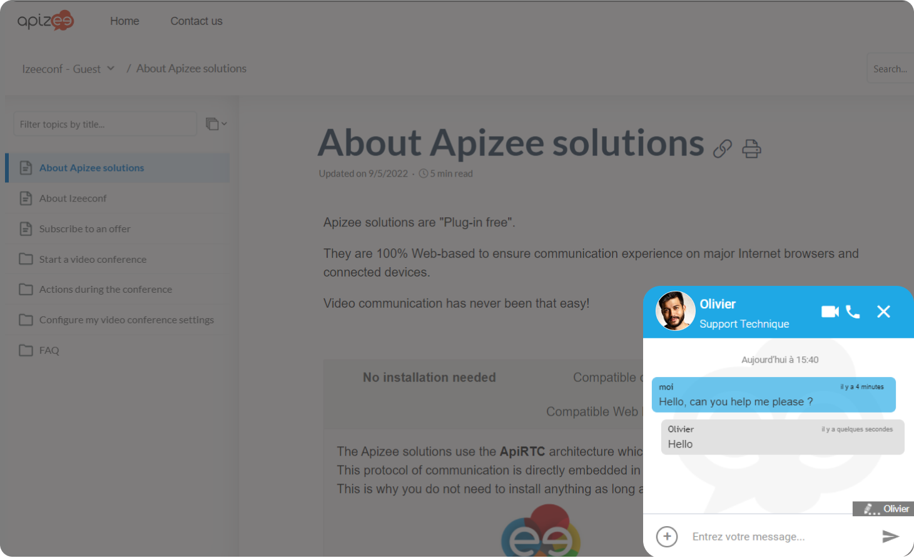
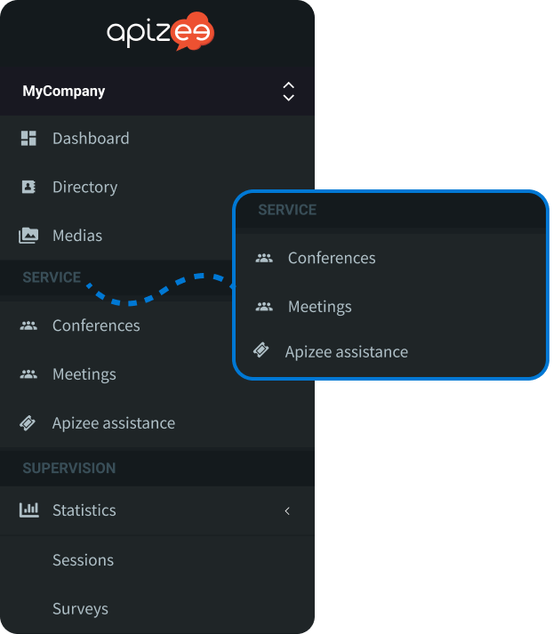

1. In the left-hand menu, under **Configuration**, click **Services management**.
2. Click **Add service**.
3. Choose the service type\* according to your need:

    | Video assistance | For video assistance with ticket management system.


**See also** [our **Apizee for Video assistance** user guide](../about-apizee-video-assistance.md)

    | --- | --- |
    | Meeting | For video conference, meeting or individual appointments.


**See also** [our **Apizee for Meetings** user guide](../meetings/users/about-apizee-meetings.md)

    | Customer engagement | For chatbox and video calls embedded on your website.


**See also** [our Apizee for **Customer engagement** user guide](https://doc.apizee.com/smart/project-contact-customer-relationship/about-apizee-customer-engagement)


\* The type of services displayed on your interface depends on the product you purchased.
4. Enter the name of your service.


The service will display with this name in the portal menu.

5. Choose the type of assistance you want.
6. Click **Add**.


The new service displays in the left-hand menu


