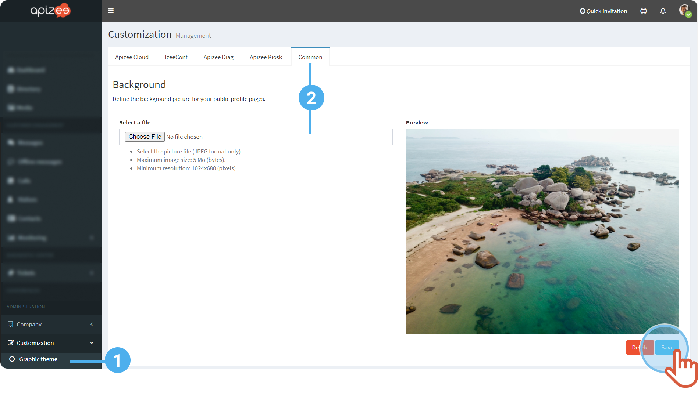
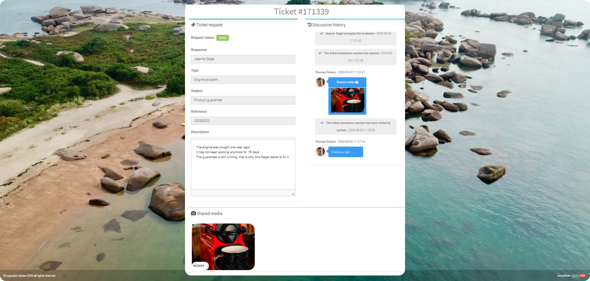

1. In the left-hand menu, click **Customization** then, **Graphic theme**.
2. In the **Common** tab, click **Choose File** to change the public page background.


- The file has to be a** .jpg**- The&#160;size has to be at least **1024*680 pixels**.

3. Click **Save**.


The background displays in the public page as follow:


