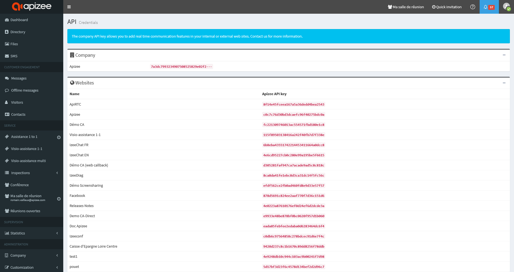

1. Go to [https://cloud.apizee.com](https://cloud.apizee.com).
2. Log in with a user that has the **Admin** role.
3. On the left panel, select **API &gt; Credentials** or go to [https://cloud.apizee.com/enterprise/api](https://cloud.apizee.com/enterprise/api).
4. In the **Company** section, find the API key. The key format looks like this: `7a3dc7993234907508525829e02f2386`.

 


Use this key to connect your applications to Apizee services.



*Do not share your API key with unauthorized users.*
 
The API key gives access to your services. Keep it secure.

