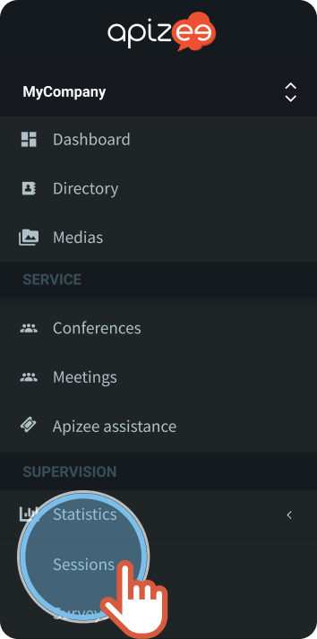
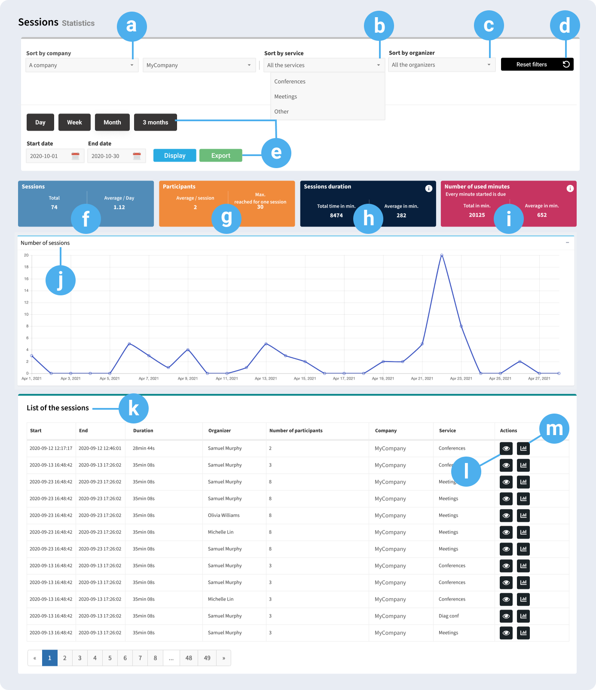
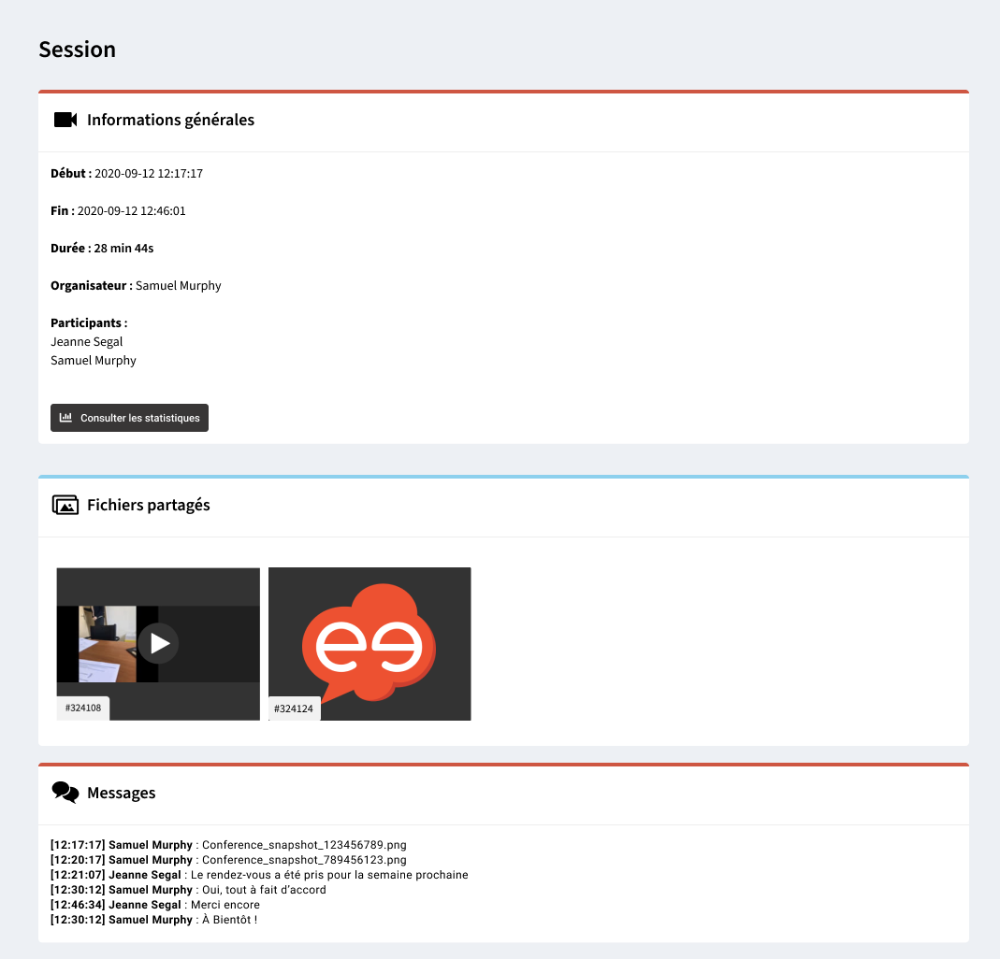
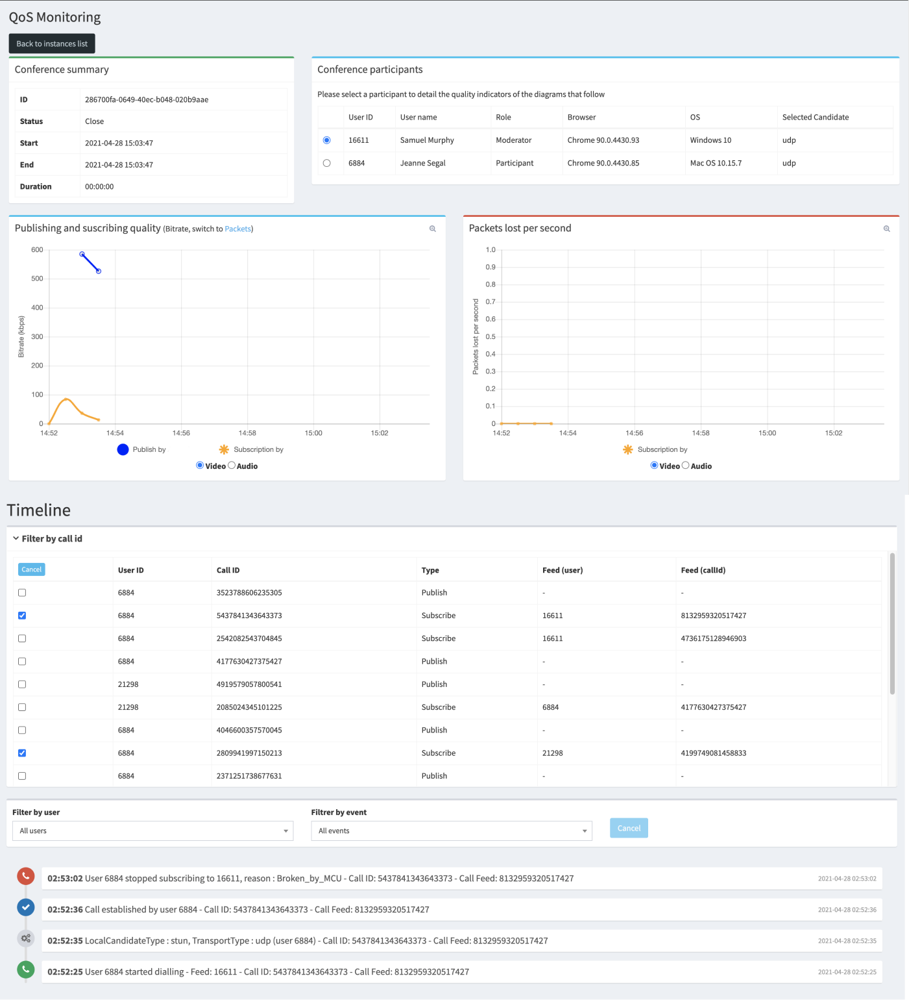

This **Statistics - Sessions** page lists all the sessions made within your company or structure.

Easily analyze, track the progress and the use of all the calls, thanks to the key figures, the diagram and the detailed list.

1. On the left-hand menu, under **Supervision**, click **Statistics** then, click **Sessions**. 
 
 
2. Choose to display the result for a **company** only, or a company group.
3. Choose the name of the company.
4. Choose to display the result for a specific service.
5. Choose an **organizer** (the person who ran the session).
6. Choose to display a result for a given period:
    * Click a button **Day**, **Week**, **Month**... 
OR
    * Choose a **starting date** then, an **ending date** in the calendar. 


You can display the results for a maximum time of 6 months.

7. Click **Display**. 


The results display below.

8. Click **Export** to export the result of the search in csv format. 
 
 

| a. | Sort by company | Displays the result for: 
  -  a company  -  a company an its sub-companies  -  the sub-companies of one company   The companies displayed in the following drop-down menu depend on your selection. |  |
| --- | --- | --- | --- |
| b. | Sort by service | Displays the result for a specific service. 
The entries in the **Service** drop-down menu depend on the company configuration. They are the same entries as the ones on the left-hand menu, under **Services**.
 
They are the entries you configured in **Configuration** &gt; **Services management**. |  |
| c. | Sort by organizer | Displays the result for all the organizers, or one in particular. 
The organizer is the one that runs the session. |  |
| d. | Reset filters | Click **Reset filters** to cancel all the choices you previously entered, and come back to the filters set by default. |  |
| e. | Filter for a given period | 2 options: 
  -  Click the button corresponding to the period of time you want  OR -  Choose the **starting **and **ending **date in the calendar.   |  |
| f. | Sessions | Displays: 
  -  the&#160;**total number**&#160;of sessions made during the period of time and  -  the&#160;**average of sessions made everyday**.   |  |
| g. | Participants | Displays: 
  -  the **average of participants for a session&#160;**and  -  the&#160;**higher number of participants reached during a session**.   |  |
| h. | Sessions duration | Displays: 
  -  the&#160;**total number of minutes for all the sessions**&#160;and  -  the&#160;**average of a session duration**.   The duration starts when the interlocutors start to communicate till the moment they leave the session. |  |
| i. | Number of used minutes | Follow-up the minutes consumption according to the offer you subscribed. 
Minutes are counted: 
  -  according to the&#160;**total minutes duration of a session**,  -  per&#160;**participants**.   Every minute started is due. |  |
| j. | Number of sessions | Displays a diagram with the **number of sessions per hour, day or month**, to help you see the sessions peaks and lows for the period of time chosen. |  |
| k. | List of sessions | Displays the details of each session (start, end, duration, organizer, number of participants…) |  |
| l. | Information | Displays the additional information about the session with:
 -  **files&#160;**shared during the session and  -  a preview of the&#160;**messages**.   |  |
| m. | QoS | |  | This option is not available for **Diag Help Desk** product. |
| --- | --- | |  |
