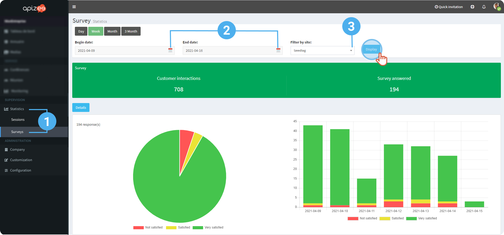
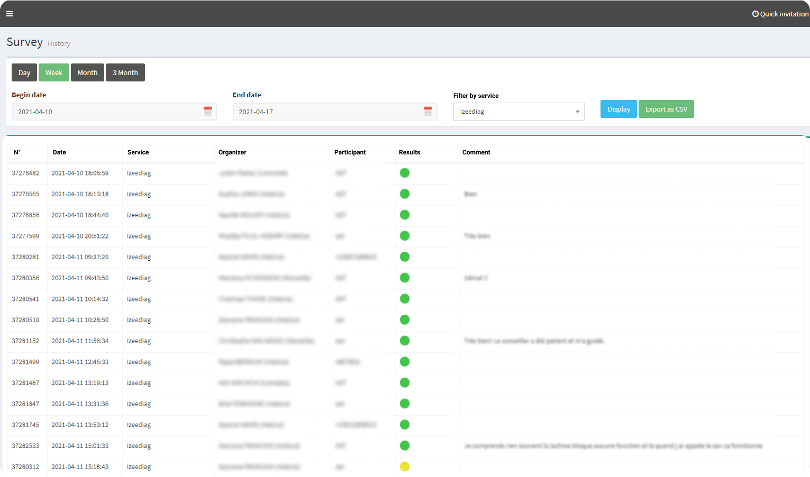


The satisfaction survey is activated for your service. 

|  | **See also:**   [Activate the satisfaction survey](../../configuration-on-the-apizee-portal/configure-the-video-assistance/activate-the-satisfaction-survey.md) |
| --- | --- |


1. On the left-hand menu, under **Supervision**, click **Statistics** then, click **Surveys**.
2. Choose a **starting** and **ending date** to display the statistics for a given period.
3. Filter the survey result according to the **site** or **service**.
4. Click **Display**. 
 
 
5. Click **Details**, if you want more information about each result. 
 
 
