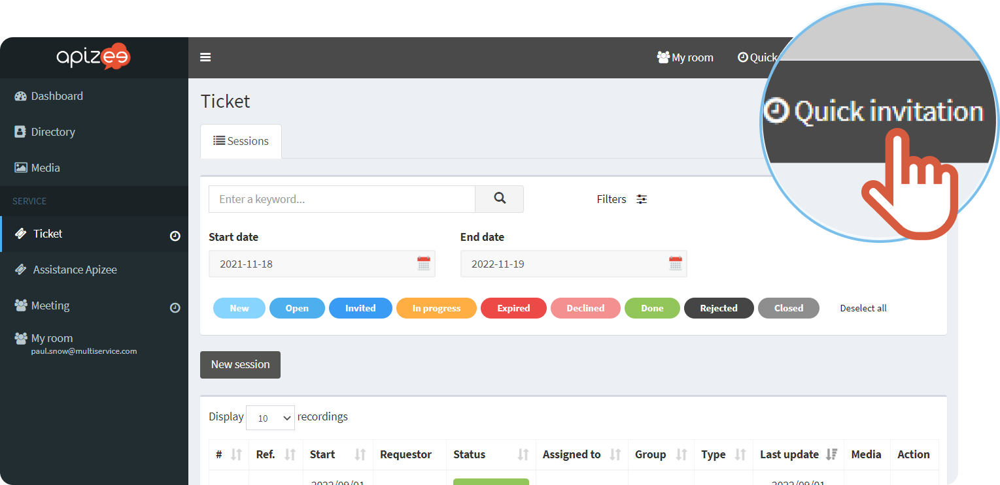
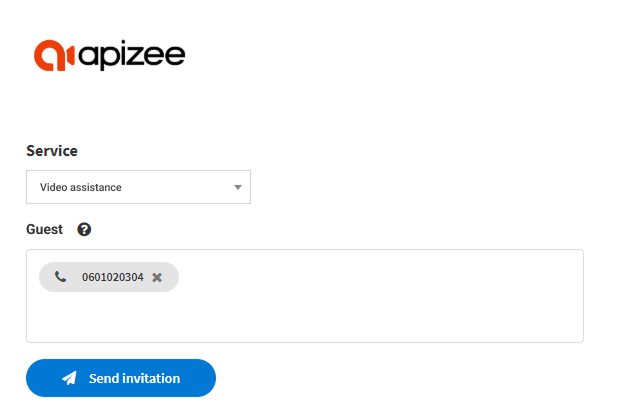

1. In the menu bar, at the top right, click **Quick invitation**. 

1. In the drop-down menu, choose the video assistance service (flow) with which you want to send the invitation.
2. Enter the guest email, phone number or a name if you use the **Directory**.

    |  | You can invite only 1 person for a video assistance. |
    | --- | --- |

3. Click **Send invitation**.


The invitation is sent.
 
The guest will receive a message with a link to join the video assistance.
 
The assistance page displays on the agent screen.

