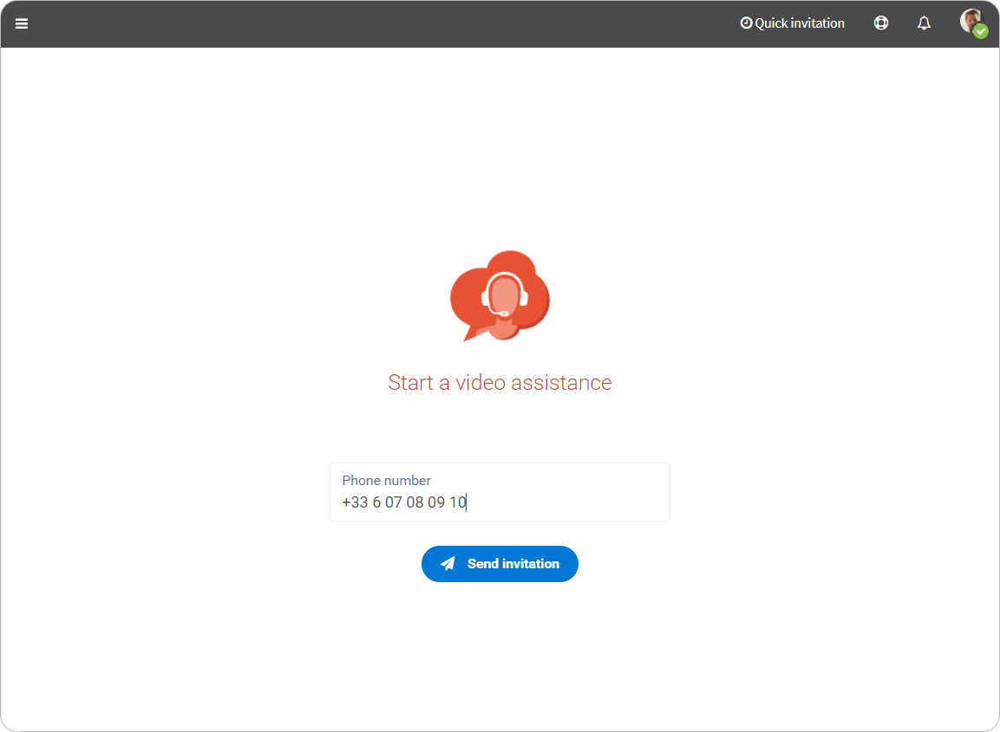
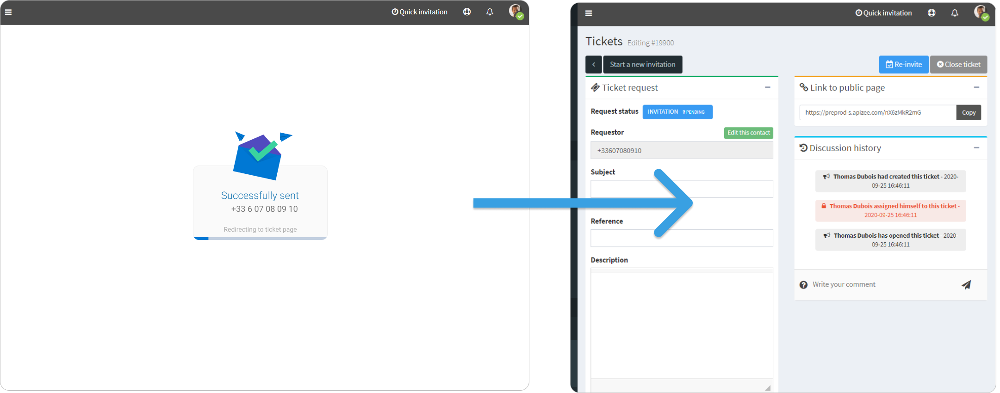


Your administrator [activated the SMS invitation feature](../../configuration-on-the-apizee-portal/configure-the-video-assistance/customize-the-tickets.md).
 
You [chose the dashboard](../../configuration-on-the-apizee-portal/configure-my-account/choose-my-portal-dashboard.md): **Diag Help Desk - Invitation by text message** for your account.


1. Enter the requester phone number. 
 
 
2. Click **Send invitation**. 

    

    The message is sent to the requester. You are directed to the **Ticket page**.

    
 
