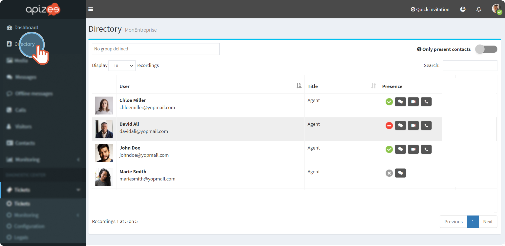
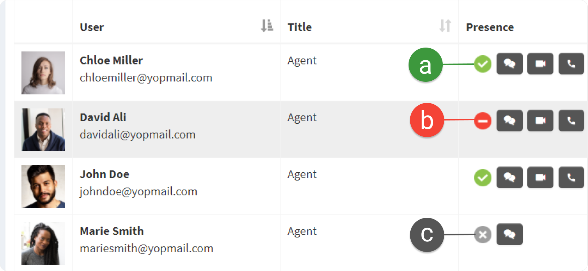
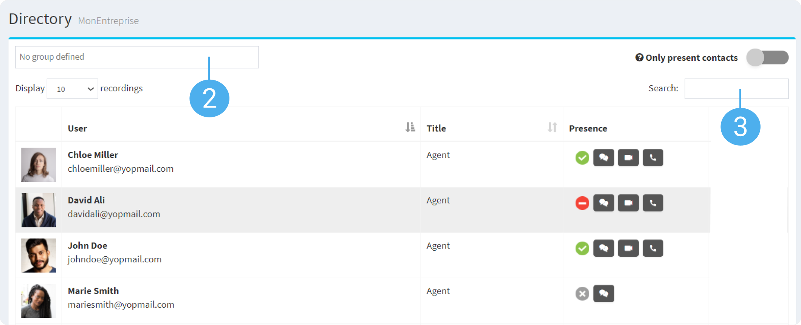
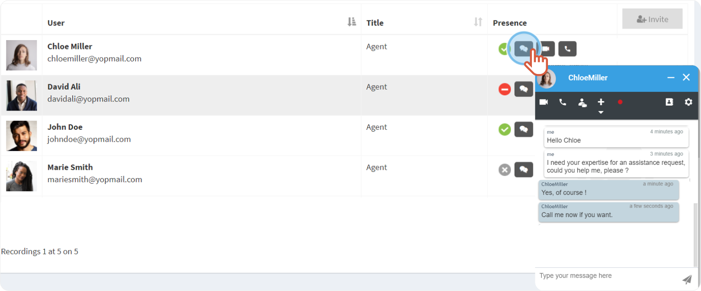
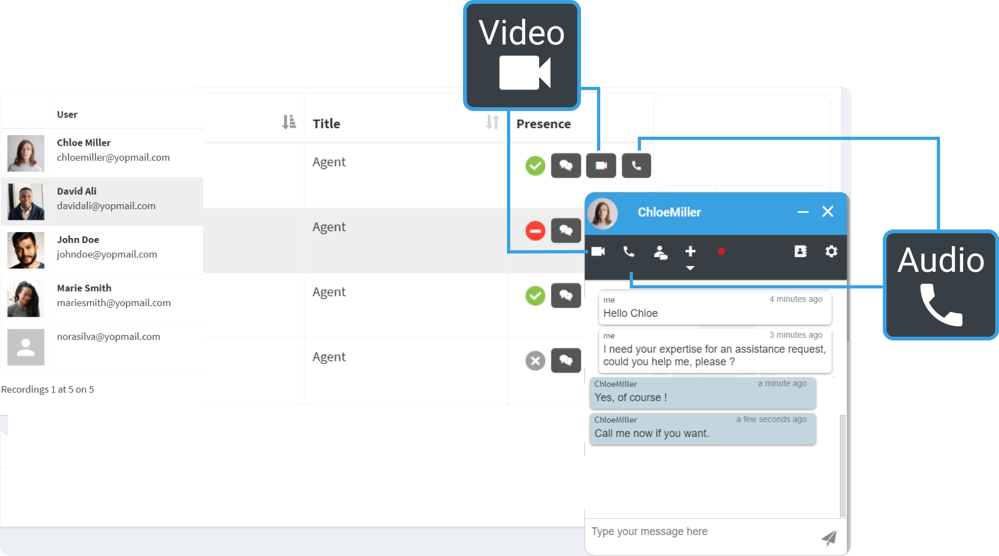

1. In the left-hand menu, click **Directory**.

    |  | The contacts display. |
    | --- | --- |

    | a. | Available |
    | --- | --- |
    | b. | Busy |
    | c. | Unavailable |
2. Filter the list by **group**.
3. Search a contact in the **search** **bar** with a name or an email address. 

4. Click a contact thumbnail to open the conversation window. 

5. Share messages.
6. Click **Video** call or **Audio** call only to start a call. 


The call starts.


