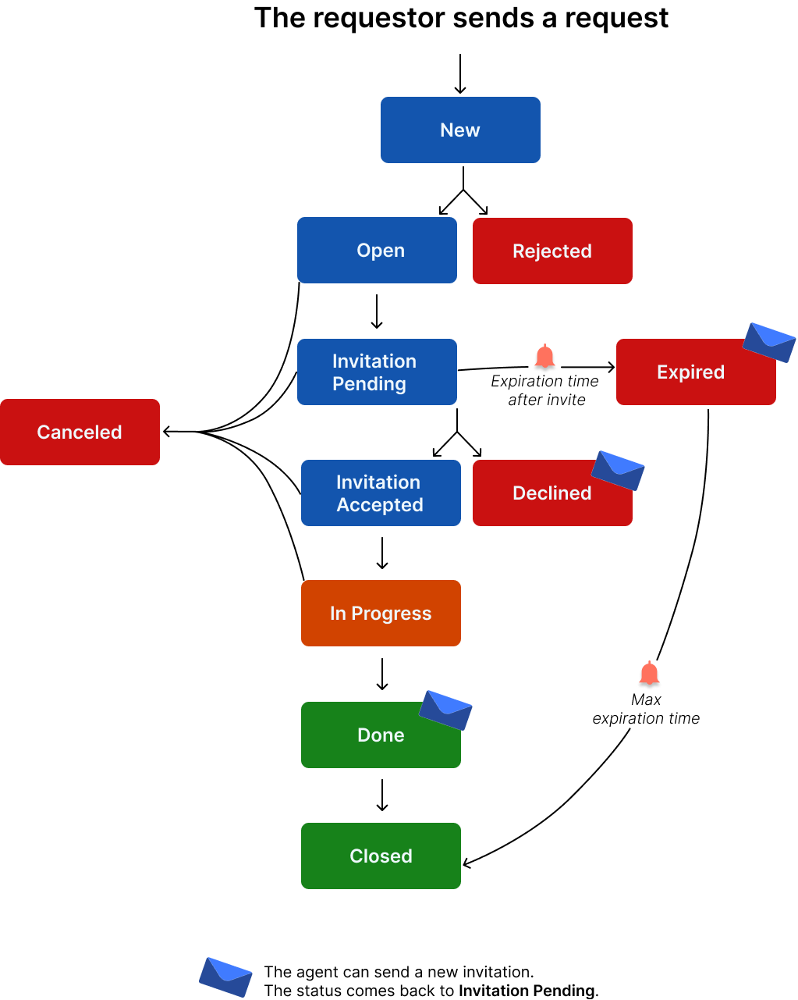
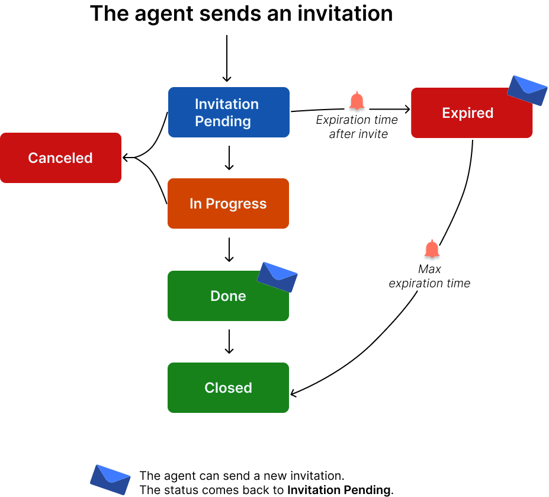
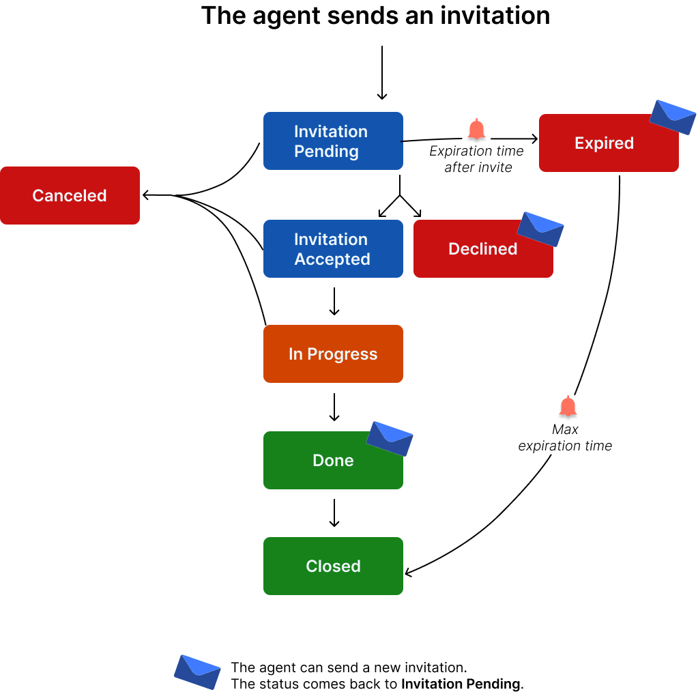

#  Ticket statuses

The statuses can change according to the type of video assistance. Click the menu that corresponds to your use:

Scheduled assistance
  

Immediate assistance
 

Assistance request form
 

| Ticket status | Explanation |
| --- | --- |
| **New** | The requester filled the assistance request and sent it (Assistance request form only). |
| **Open** | The supervisor analyses the request and changes the status into **Open** before they assign it to an agent (Assistance request form only). |
| **Rejected** | The supervisor analyses the request and changes the status into **Rejected** (Assistance request form only). |
| **Invitation pending** | The invitation is sent to the guest. 
 As a scheduled assistance, the guest can accept or decline the invitation. |
| **Invitation accepted** | The guest received the invitation. 
 The guest accepted the invitation:
  - directly in the message   
or
  - on the ticket public page (thanks to a link in the invitation)   |
| **Declined** | The guest received the invitation. 
 The guest declined the invitation:  - directly in the message  or  - on the ticket public page (thanks to a link in the invitation)    
 


 

The agent can invite the guest again, change the date and time of the video assistance.
 


| **Canceled** | The session can be **Canceled**  **** by an agent when the status is:
- **Open**- **Invitation pending**- **Invitation accepted**- **In progress**
When a session is canceled it is as if it was closed. You cannot invite the guest to this session anymore. |
| **Expired** | Here are the ways a ticket can expire:
  -  The guest received the invitation and did not click the link in the message.  -  The ticket changes into **Expired **after a certain amount of time. The time is configured by the administrator (**<a href="../../admins/configuration-on-the-apizee-portal/configure-the-video-assistance/customize-the-tickets.md#expiration-time-after-invite" target="_blank" title="Check the article about the configuration of this trigger">Time trigger - Change status to Expired</a>**). 
   


   

The agent still can invite the guest again if the expiration time is over 0.
   


| **In progress** | The video assistance started between the agent and the guest. |
| **Done (Completed)** | Here are the ways a ticket can change to **Done (Completed)**:  -  The guest or the agent clicked **Done**.  -  If the satisfaction survey is activated, the ticket changes from **In progress** to **Done** when the guest clicks **Send **after answering to the satisfaction survey.  -  If the guest or the agent hung up and the&#160;**End transfer notification delay**&#160;is exceeded, the ticket status changes automatically into **Done**.  - If the guest sent files when no agent was available and the&#160;**End transfer notification delay**&#160;is exceeded, the ticket status changes automatically into **Done**.   



*[Time trigger - Change status to Completed](../video-assistance/admins/configuration-on-the-apizee-portal/configure-the-video-assistance/customize-the-tickets.md/a/end-transfer-notification-delay "Check the article about the configuration of this trigger")**is configured by the administrator.


| **Closed** | Here are the ways a ticket can change to **Closed**:
  -  The agent clicked **Close**.  -  If the guest did not click the link in the invitation after a certain amount of time. The time is configured by the administrator (**<a href="../../admins/configuration-on-the-apizee-portal/configure-the-video-assistance/customize-the-tickets.md#max-expiration-time" target="_blank" title="Check the article about the configuration of this trigger">Time trigger - Change status to Closed after expiration</a>**).   |



**See also** [Customize the tickets](../video-assistance/admins/configuration-on-the-apizee-portal/configure-the-video-assistance/customize-the-tickets.md)

