#  Real-time timeline of the session.


You are an agent and you need to:
  - understand **in which step your interlocutor ****is **to join the video assistance  - **retrieve some events** of the video assistance  - have a **quick sum up** of what happened during the video assistance  


1. In the left-hand menu, click the service you want.
2. In the ticket list, find the ticket you want to follow up and click 

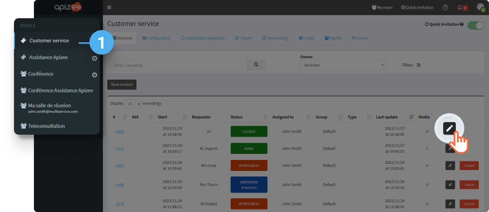


The assistance page displays.

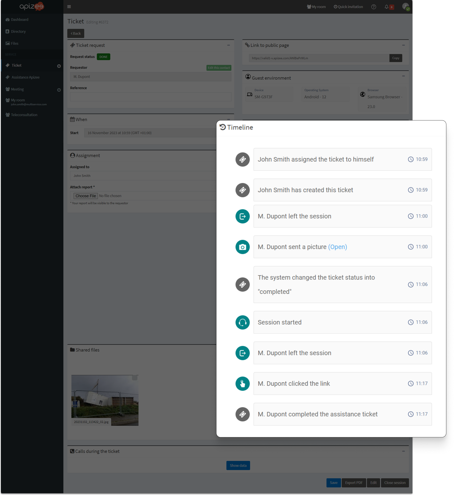
3. On the right hand side, under **Timeline**, check the different events.

| Event | Event | Explanation | Event ID\* |
| --- | --- | --- | --- |
|  | Session created | An agent or a supervisor [created a ticket](../start-a-video-assistance/create-a-ticket-send-an-invitation/create-a-ticket-common-invitation.md). | 12 |
|  | Assistance assigned to someone | The assistance has been assigned to an agent [during the creation](../start-a-video-assistance/create-a-ticket-send-an-invitation/create-a-ticket-common-invitation.md#assign-assistance-ticket-creation), or [after](follow-a-ticket.md#assigne-assistance-follow-ticket). | 13 |
|  | Invitation sent | The invitation to an assistance has been sent after the ticket creation. | 4 |
|  | Invitation link not clicked | The guest did not click the link in the assistance invitation.

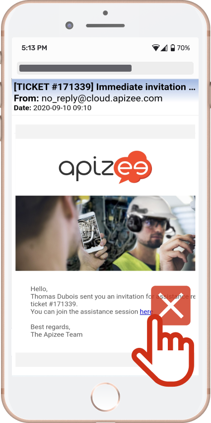 | 27 |

Invitation declined | |  | For **scheduled** assistance only.

The guest clicked the **More information** link in the invitation, then, **declined** the invitation. 
The agent can still invite the guest again on another date and time that suits best.

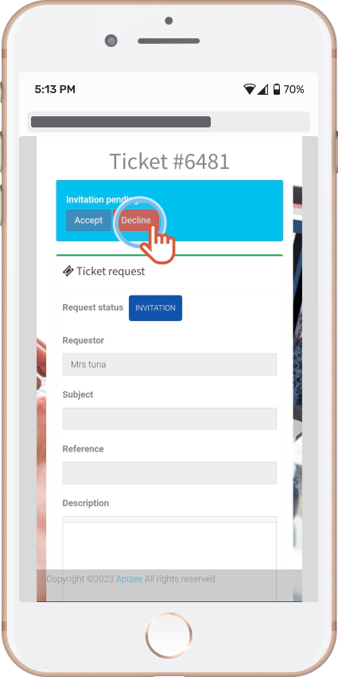 | 5 |

Invitation accepted | |  | For **scheduled** assistance only.

The guest **accepted** the invitation to the assistance.

 | 6 |

Priority of the session changed into "scheduled" | |  | [Scheduling](../video-assistance/admins/configuration-on-the-apizee-portal/configure-the-video-assistance/customize-the-tickets.md/a/schedule-feature-description) option has to be activated.

The video assistance was immediate and has been changed to be scheduled on another moment. | 18 |
|  | Appointment canceled | The agent [canceled the video assistance appointment](cancel-a-session.md).    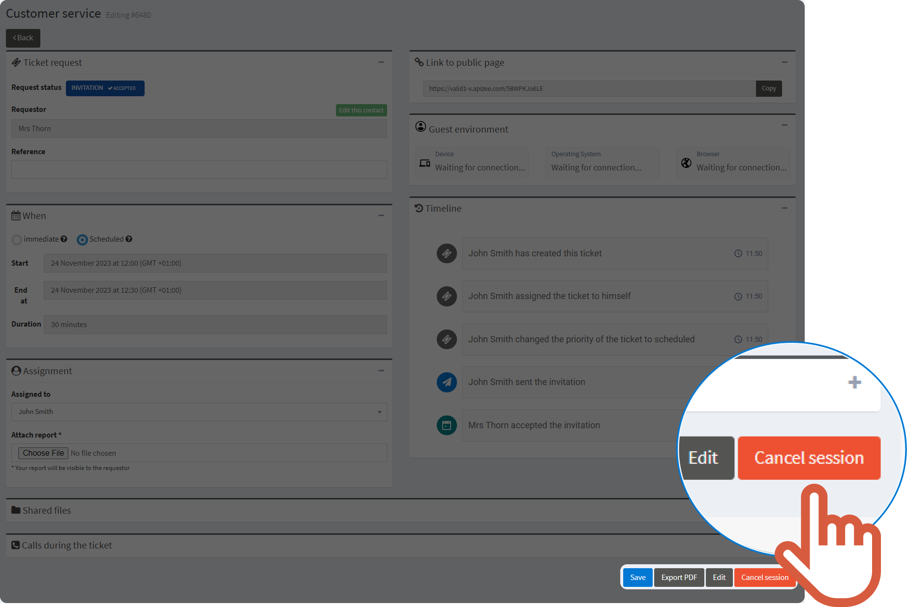 | 37 |
|  | Another invitation sent | The agent [sent a new invitation](send-new-invitation-for-same-session.md) to the guest for the same assistance.    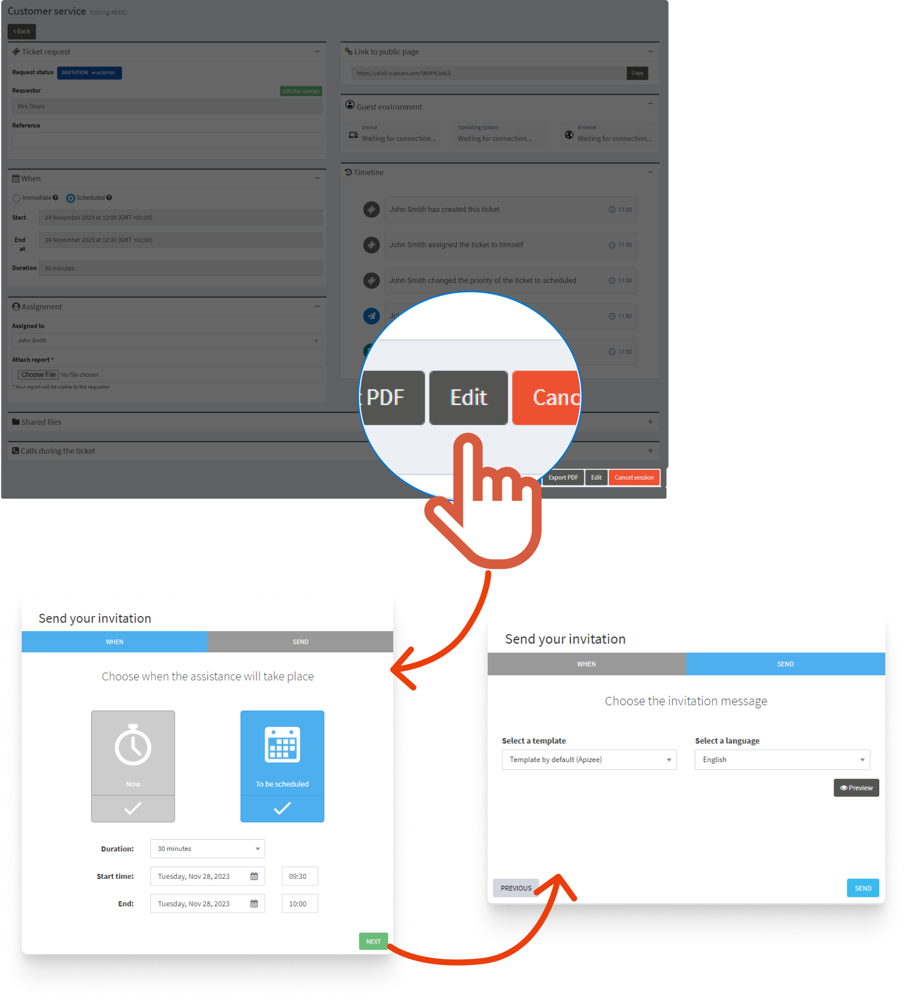 | 35 |
|  | Invitation link clicked | The guest clicked the link in the assistance invitation.    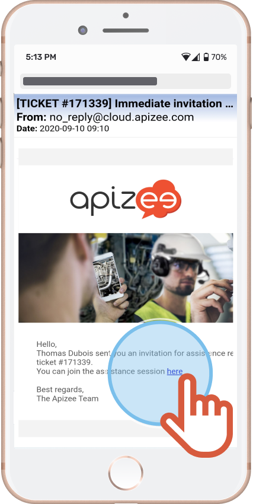 | 26 |
|  | Session can start | The page of the link displays on the guest screen now.    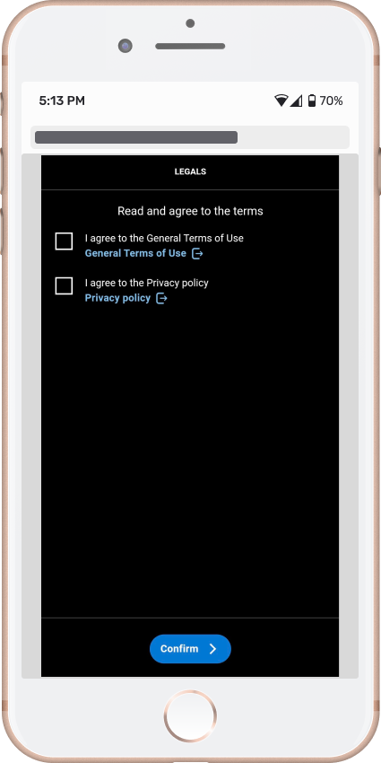 | 10 |
|  | Legal terms agreed | The guest checked the boxes and clicked **Confirm** to the legal terms.    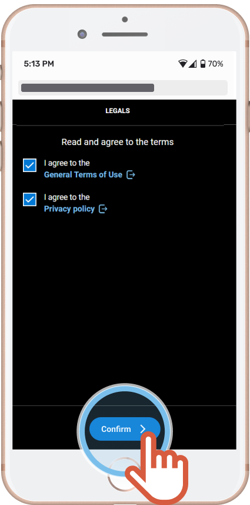 | 19 |
|  | Contact an agent button clicked | The guest clicked the button to join the assistance.    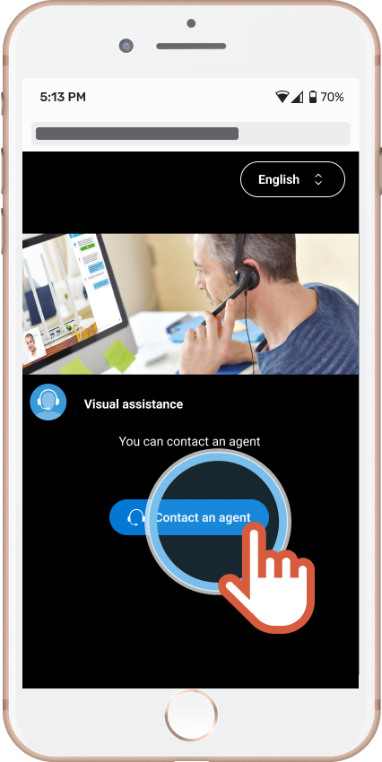 | 30 |
|  | Camera and microphone allowed | According to the video assistance configuration, the guest can be asked to allow the access to both camera and microphone.    In this case, the guest **allowed** both of them.    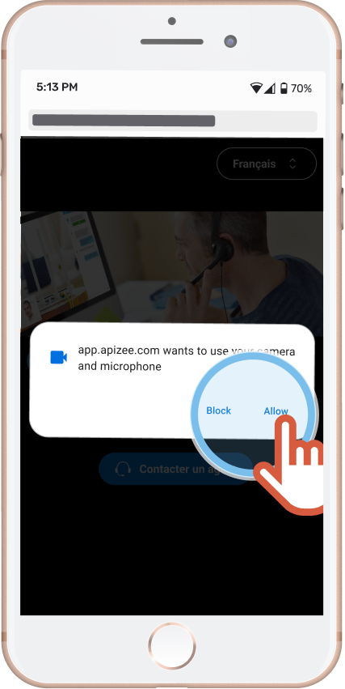 | 20 |
|  | Camera and microphone denied | According to the video assistance configuration, the guest can be asked to allow the access to both camera and microphone.   In this case, the guest **blocked** the access to both of them. Or **did not click** at all.    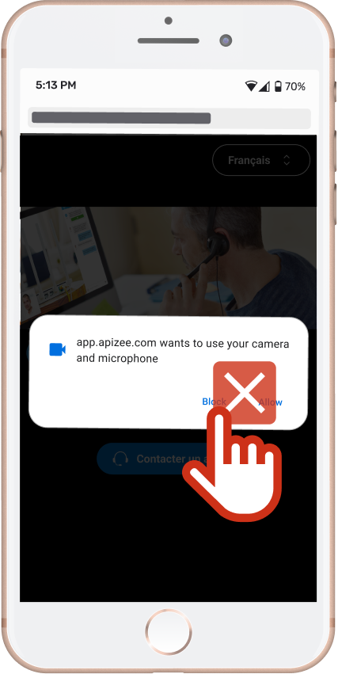 | 21 |
|  | Camera allowed | According to the video assistance configuration, the guest can be asked to allow the access to the camera only.    In this case the guest **allowed**. | 22 |
|  | Camera denied | According to the video assistance configuration, the guest can be asked to allow the access to the camera only.    In this case the guest **blocked** it. | 23 |
|  | Microphone allowed | According to the video assistance configuration, the guest can be asked to allow the access to the microphone only.    In this case the guest **allowed**. | 24 |
|  | Microphone denied | According to the video assistance configuration, the guest can be asked to allow the access to the microphone only.    In this case the guest **blocked** it. | 25 |
|  | Session started | The agent picks up the call.    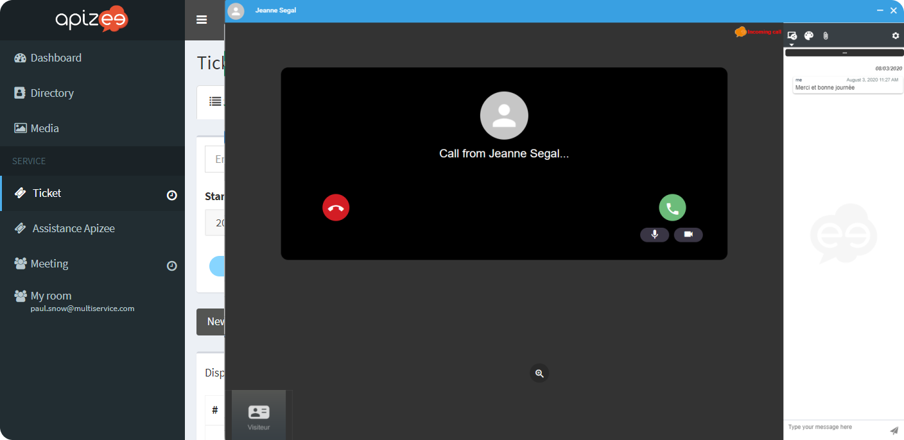 | 36 |
|  | Picture taken by the agent | The agent [took a screenshot](../actions-during-the-video-assistance/take-a-picture-and-draw-on-it.md) of the guest video.    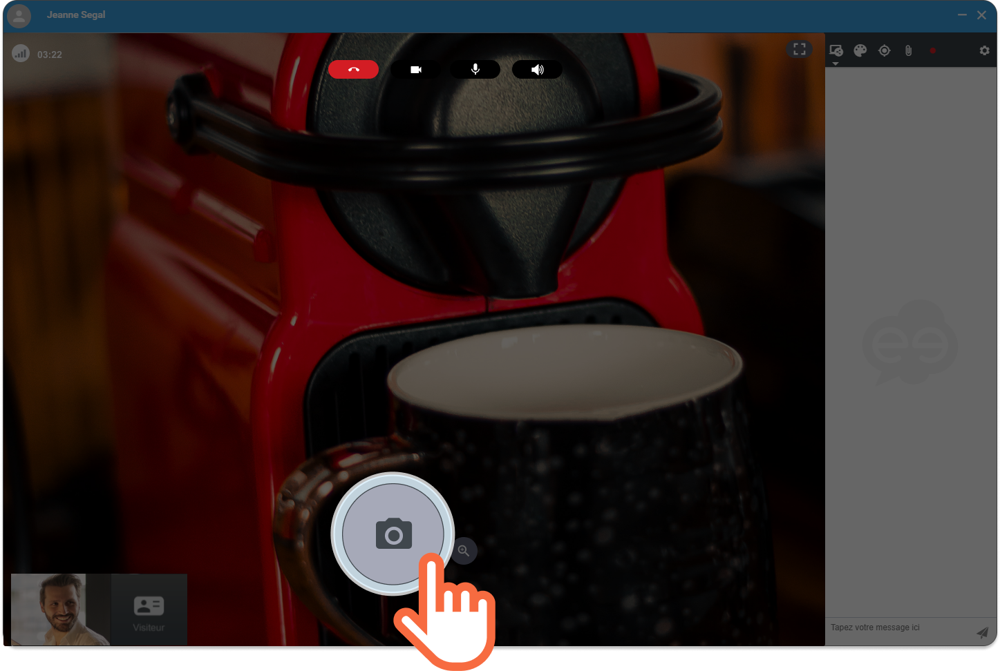 | 38 |
|  | Picture sent by the guest | The guest [shared a file](../actions-during-the-video-assistance/share-and-download-files/share-file-with-an-agent.md) with the agent.   - **During **a call:   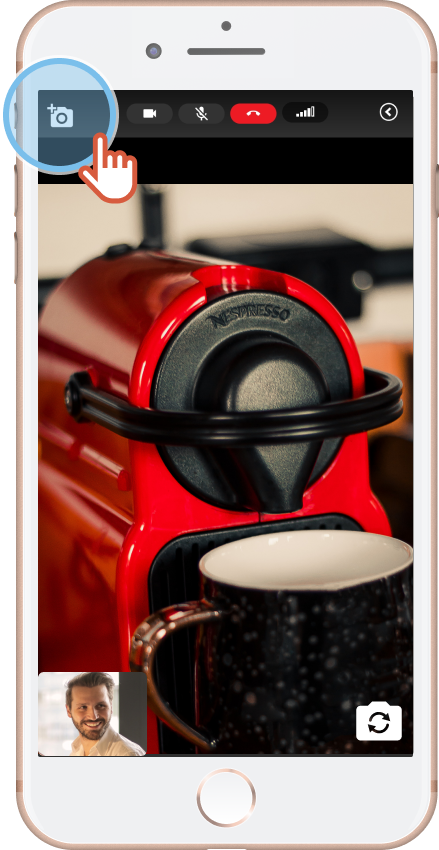   - **After **a call:   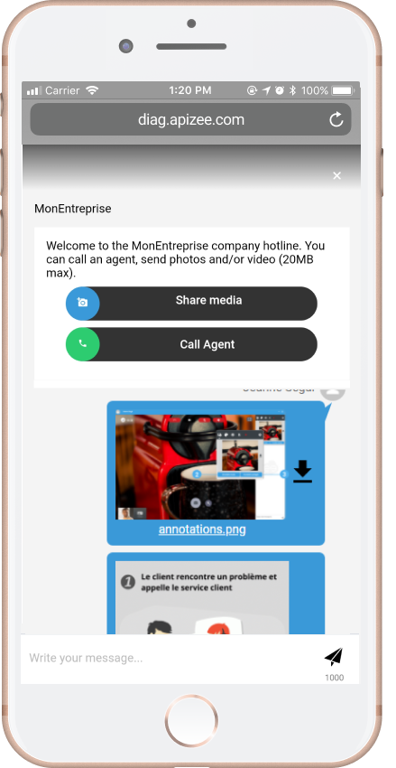 | 39 |
|  | Geolocation accepted | The guest **allowed** the geolocation.    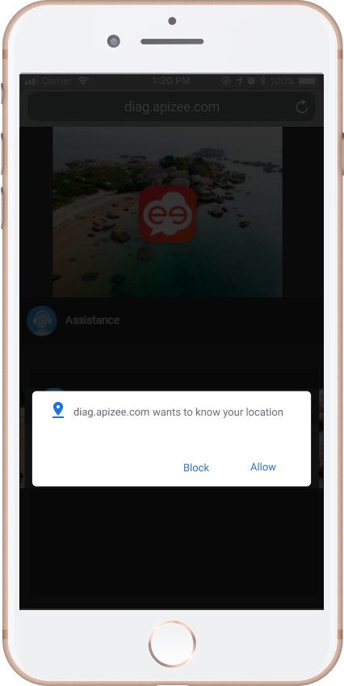 | 28 |
|  | Geolocation declined | The guest **blocked** the geolocation. | 29 |
|  | Guest left the session | The guest clicked **leave** to hang up the call.    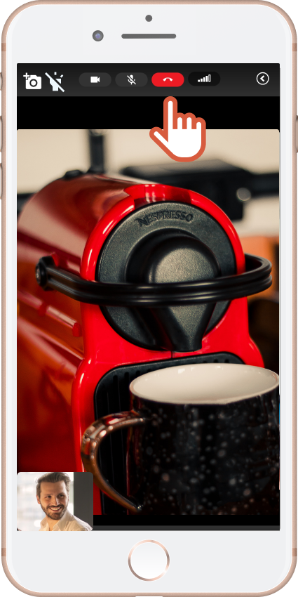 | 33 |
|  | Agent left the session | The agent clicked **leave** to hang up the call.    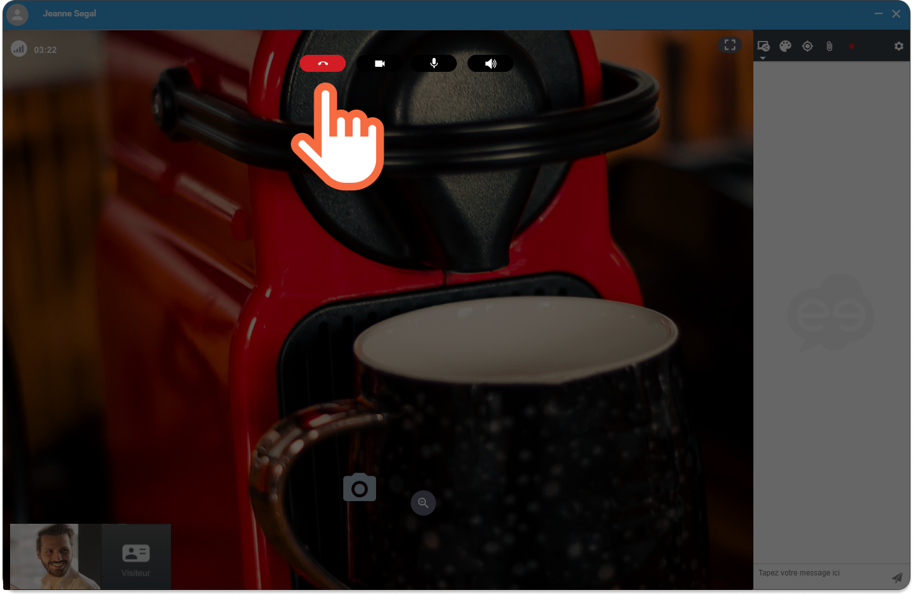 | 32 |
|  | Agent completed the assistance | The agent clicked **Complete session** in the assistance page.    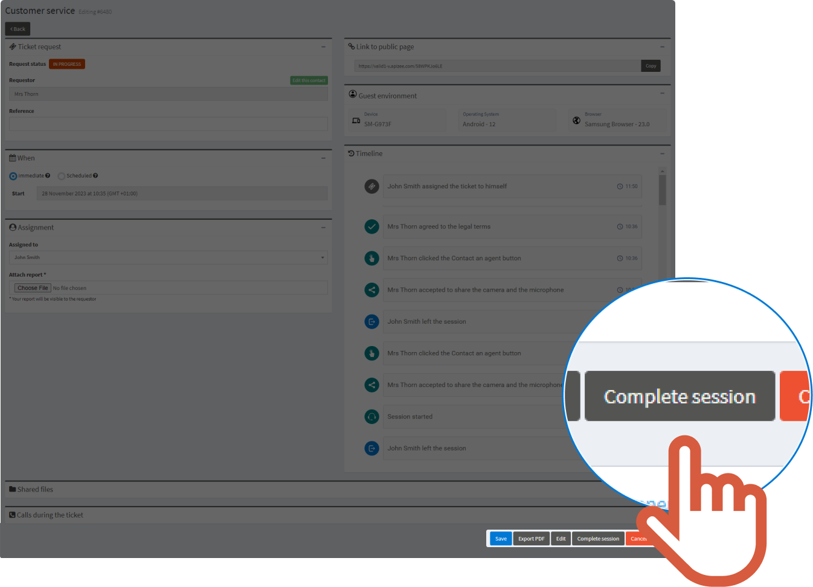 | 11 |
|  | Guest completed the assistance | The guest clicked **close** to complete the assistance.    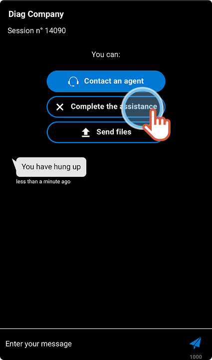 | 11 |
|  | System changed the session status into "completed" | The status of the session automatically changed into "completed" because the **[End transfer notification delay (min)](../video-assistance/admins/configuration-on-the-apizee-portal/configure-the-video-assistance/customize-the-tickets.md/a/end-transfer-notification-delay)** trigger is exceeded.


**See also** [Configure the triggers](../video-assistance/agents/follow-up-the-assistances-on-the-portal/attach-a-report-to-the-ticket.md)


**See also** [What status for my ticket?](video-assistance-ticket-status.md)

|  | Guest responded to the survey | After the session, the guest [responded to the satisfaction survey](../respond-to-the-satisfaction-survey.md) and clicked **Send**.    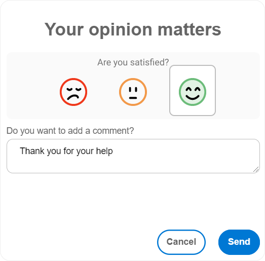 | 40 |
|  | Agent closed this session | The agent clicked **Close session** in the assistance page.    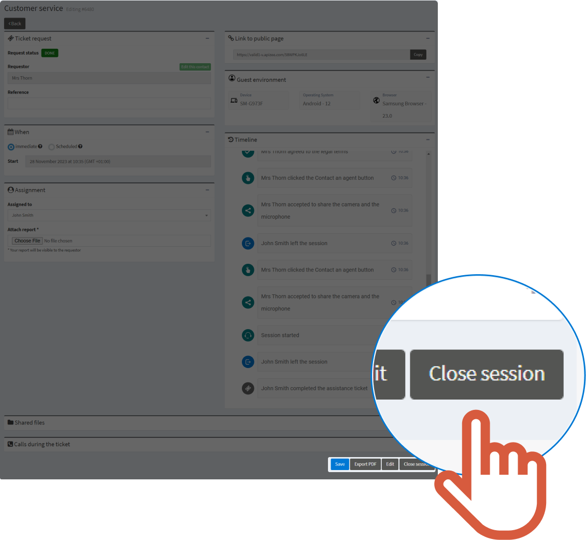 | 8 |
|  | The system changed the session status into “closed” | The status of the session automatically changed into "closed" because the **[Max expiration time (min)](../video-assistance/admins/configuration-on-the-apizee-portal/configure-the-video-assistance/customize-the-tickets.md/a/max-expiration-time)** trigger is exceeded.


**See also**https://doc.apizee.com/articles/project-diag-help-desk-diagnostic-center/attach-a-report-to-the-ticket[Configure the triggers](../video-assistance/admins/configuration-on-the-apizee-portal/configure-the-video-assistance/customize-the-tickets.md)


**See also**https://doc.apizee.com/articles/project-diag-help-desk-diagnostic-center/attach-a-report-to-the-ticket[What status for my ticket?](video-assistance-ticket-status.md)



\* **Event ID** is only for users who use the APIs.

