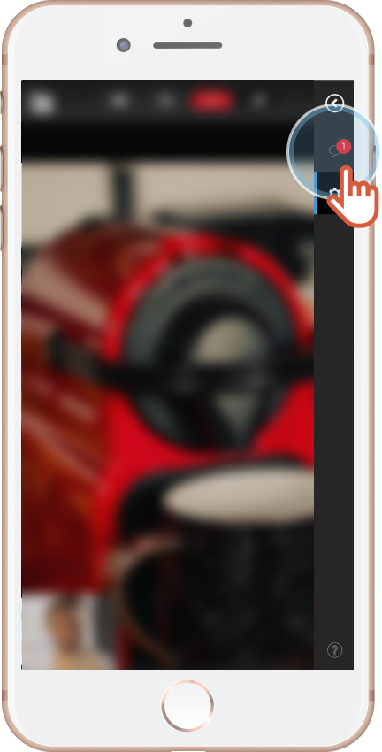
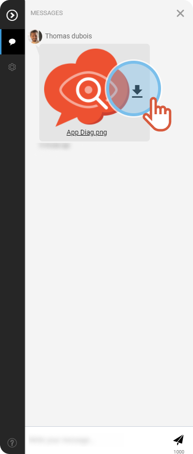

# Download files:

* [During the session](download-files-shared-during-assistance-session.md)
* [After the session](download-files-shared-during-assistance-session.md)
* [How can I go to the public page?](download-files-shared-during-assistance-session.md)

## During the session


You are participating in an ongoing assistance session. 
Someone shared a file with you.


1. You received a notification in the **Messages** tab. Click on the tab. 
 
 
2. Click the **arrow** next to the image to download the file. 
 
 

## After the session


You are a requester and the assistance session is over now.



If you did not download the files shared during the assistance, you can get them back on the ticket **public page**.


###  How can I go to the public page?

* The agent sent the page link to you. 
or
* You received a message with a link to the page.

1. Click the link of the public page. 

    

    The page displays.

    
2. Scroll down the page to **Shared media**. 
 
 
3. Click the picture you want to download. 
 
  

    

    The picture opens wide.

    
4. Press and hold on the picture and click **Save image as...   **
