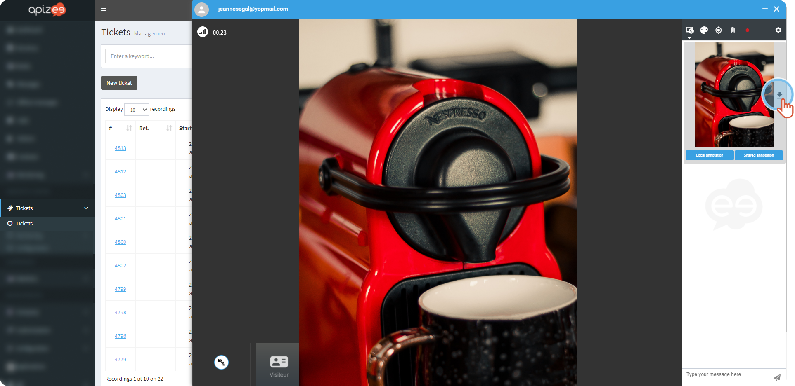
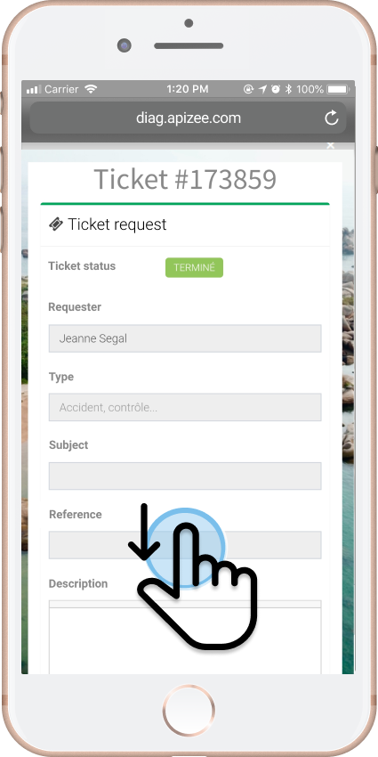
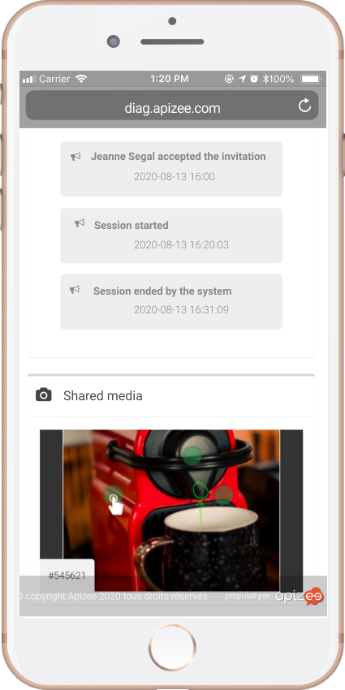
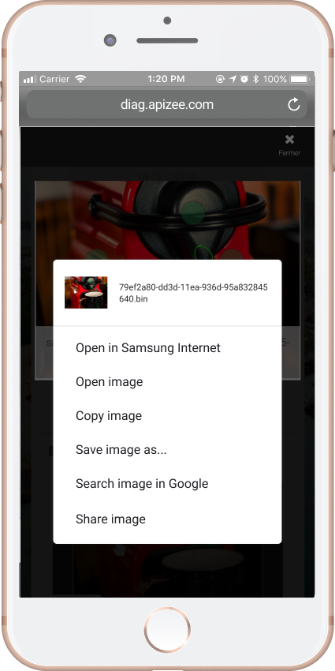
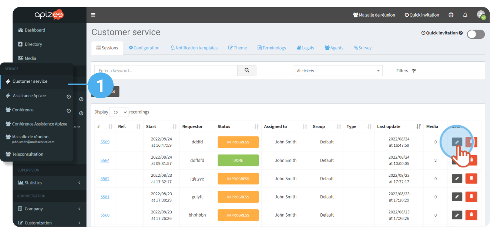
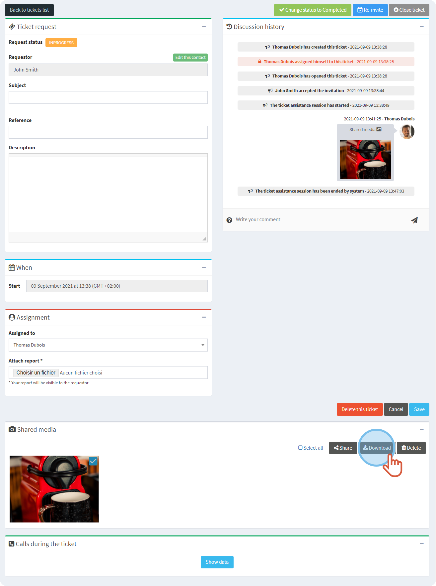

#  During the session


You are participating to an ongoing assistance session. 
Someone shared a file with you.


1. You received a notification in the **Messages** tab.
2. Click the **arrow** next to the image to download the file. 
 
 

# After the session


You are a requester and the assistance session is over now.



If you did not download the files shared during the assistance, you can get them back on the ticket public page.


##  How can I go to the public page?

* The agent sent the page link to you. 
or
* You received a message with a link to the page.

1. Click the link of the public page. 

    

    The page displays.

    
2. Scroll down the page to **Shared media**. 
 
 
3. Click the picture you want to download. 
 
  

    

    The picture opens wide.

    
4. Press and hold on the picture and click **Save image as...   **

# After the session in the portal


You are the organizer of the session from which the files are from. Or, you are an administrator. 
You are logged in to you account.


1. On the left-hand menu, click **Tickets**.
2. In the list, find the session you want and click 

 

    

    The page displays.

    
3. Under **Shared files**, select the file you want and click **Download**.


The files that display under **Shared files** are:- The pictures taken in a remote way by the agent.
Or- The files sent to the agent by the requester.
The files shared by the agent during the session, thanks to the **paper clip** button do not appear under this section.

