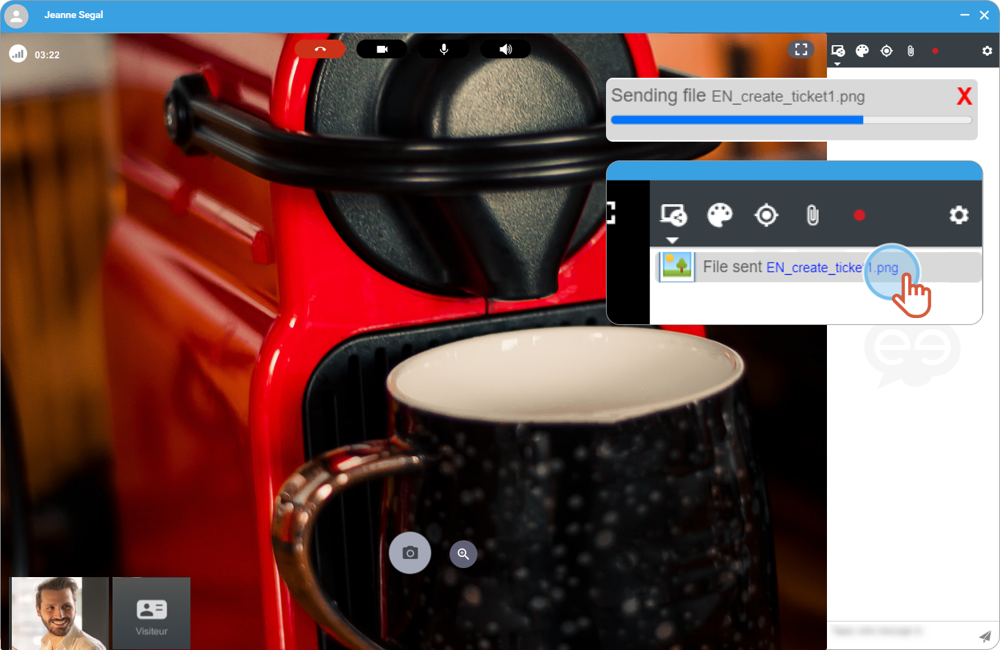
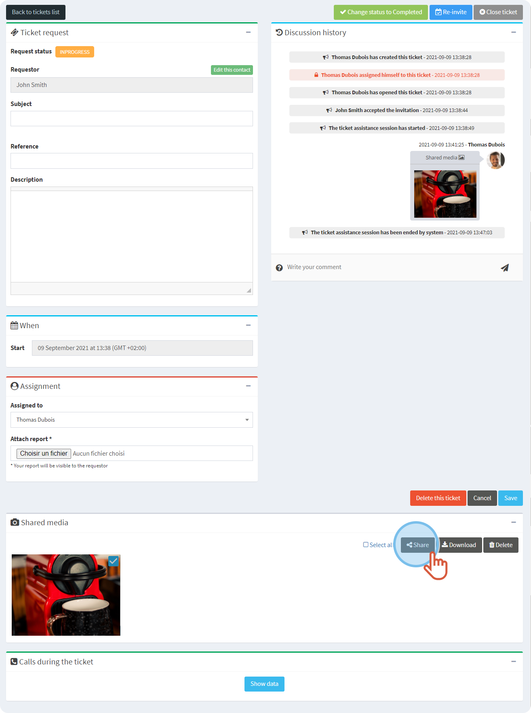
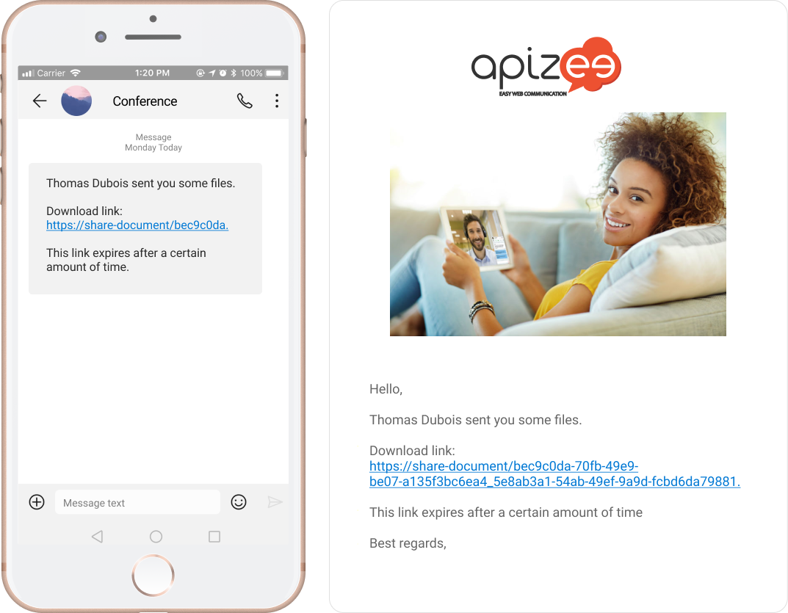

#  During the session

1. On the right hand-side, click the **paper clip**. 

2. Choose the file you want to share.
3. Click **Open**. 


The file charges then, it displays in the conversation window on the right.


 


Unlike the **agent**, all the files shared by the **requester** are available after the session:
-  in the portal on the ticket page under **Shared media**. -  in the ticket public page.   
If you are an **agent**, the files you share will not display. Only the pictures you opened in the whiteboard will display on the pages below.


#  After the session in the portal


You are the organizer of the session from which the files are from. Or, you are an administrator.
You are logged in to your account.


1. In the left-hand menu, click **Tickets**.
2. In the list, find the session you want and click  
 
  

    |  | The page displays. |
    | --- | --- |
3. Under **Shared Media**, choose the files and click **Share**. 
 

    |  | A window opens. |
    | --- | --- |
4. Enter en email address.
5. Click **Send**. 

    |  | The persons to whom you shared the files receive a message with a new download link. |
    | --- | --- |

 

* * *

**Watch the tutorial**

[More tutorials](../tutorials.md)
