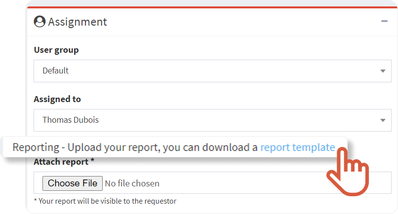
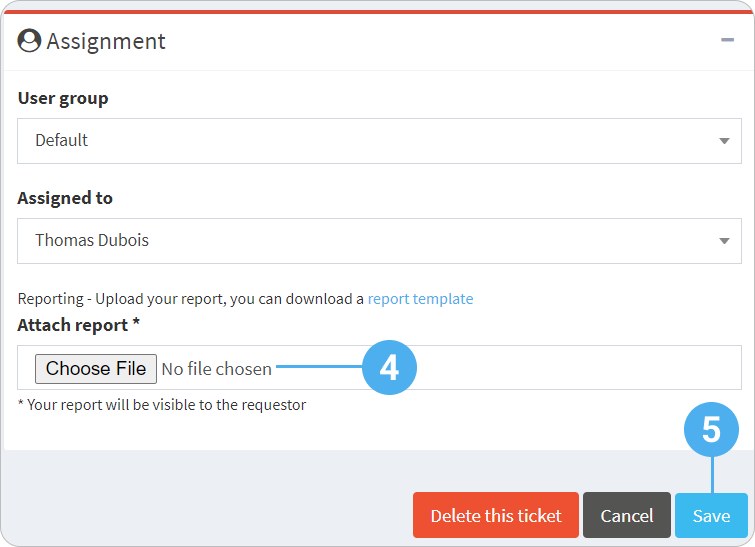

#  Attach a report to the ticket

1. In the left-hand menu, click the service for which you want to attach a report.
2. In the ticket list, find the ticket you want to attach a report to and click  
 


The ticket page displays.

3. Go to the **Assignment** menu, in **Attach report**. 

|  | If your company configured a report template, this message displays: **You can download a report template**   - Click **report template**.        The report template downloads.    - Open the document, fill it and save it. |
    | --- | --- |
4. Click **Choose File** to import the report you just filled.
5. Click **Save**. 
 
 


The report is attached and display at the bottom of the **Ticket request** menu.

