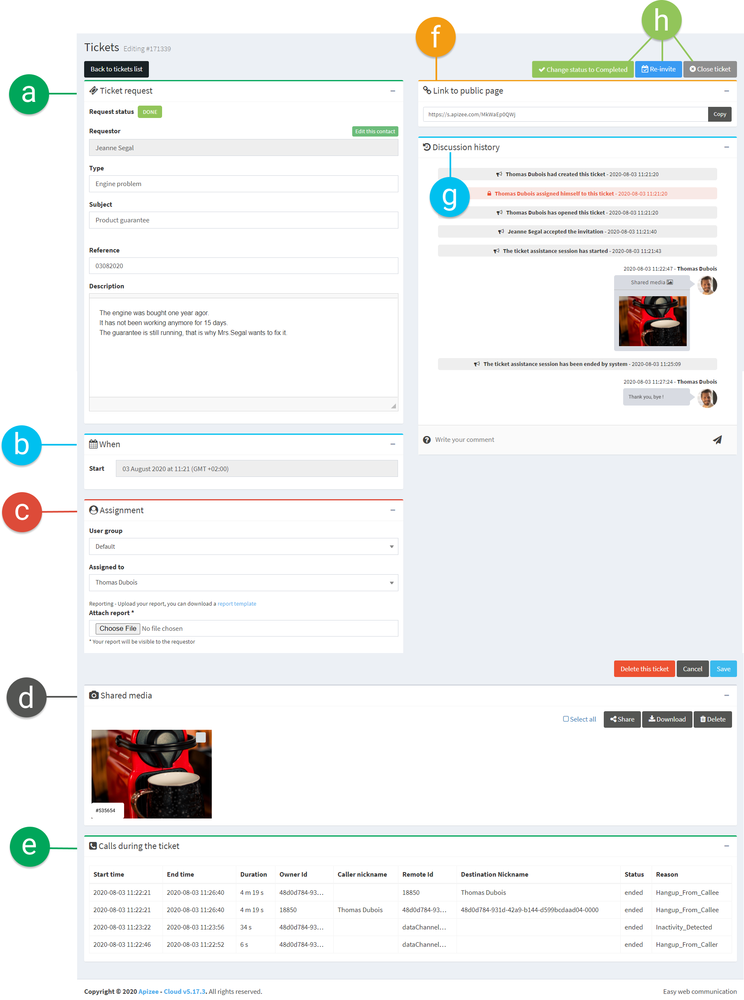
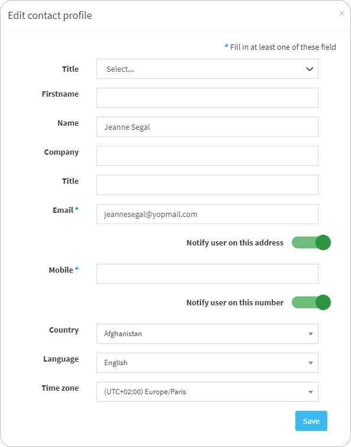
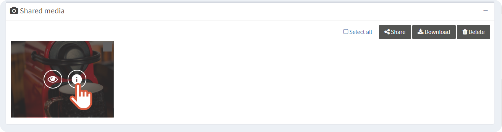
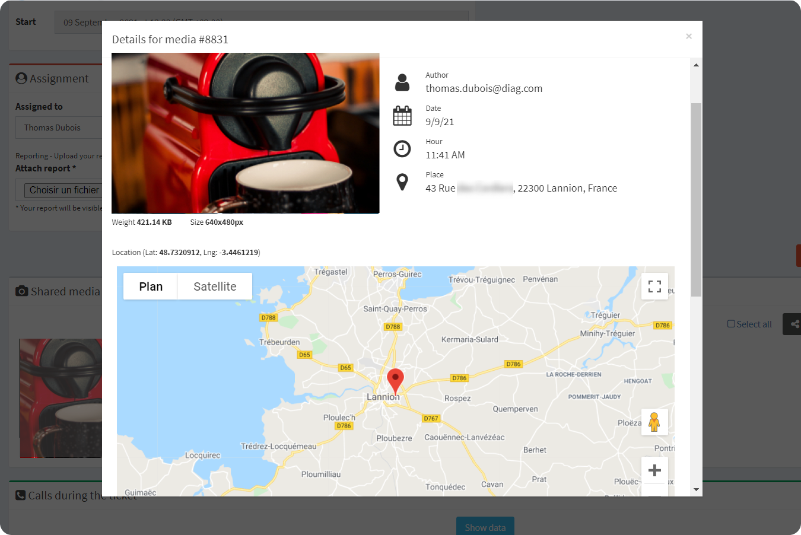
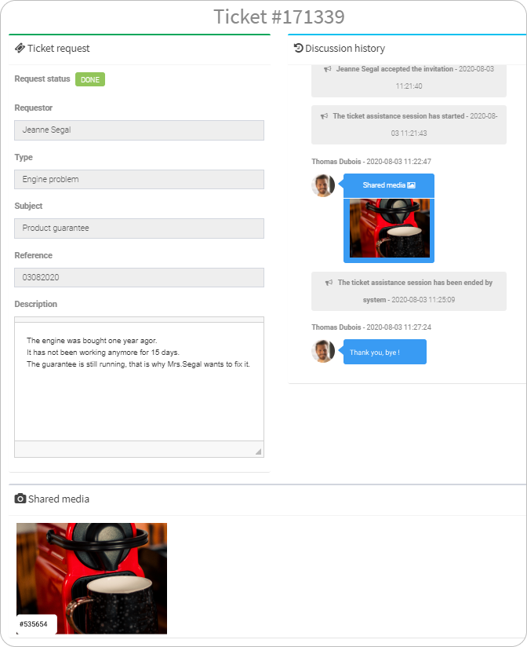

1. In the left-hand menu, click the service you want.
2. In the ticket list, find the ticket you want to follow up and click 


The page of the ticket displays. You can find the following information:


| a. | Ticket request | Information given when creating the ticket. | 1. Click in the fields to change the content then click **Save**at the bottom of the page.
 
2. Click **Edit this contact** to change the information about the requester then, click **Save**. 
 
  |
| --- | --- | --- | --- |
| b. | When | Date and time set for the assistance. |  |
| c. | Assignement |  -  Person in charge of the ticket.  -  Assistance report.   |  -  Click the **Assign to** drop-down menu to assign the ticket to another person.  -  Click **Choose File**&#160;to upload the assistance report.   


**See also** [Attach a report to the ticket](attach-a-report-to-the-ticket.md)

| d. | Shared media | Files shared during the assistance.
 

 -  Files opened in the whiteboard during the session  -  Files sent to the agent by the requester before or after the session  -  Pictures the agent took remotely   | If you want to know more about the file geolocation and timestamp:
- Move your mouse over the file and click&#160;

 The information displays

- If you want to share the file or download it, tick the box and click **Share **or **Download**. 

|  | **See also** [Share a file with the requester](../actions-during-the-video-assistance/share-and-download-files/share-a-file-with-a-requester.md) 
**See also** [Download the files shared during assistance session](../actions-during-the-video-assistance/share-and-download-files/download-files-shared-during-assistance-session.md) |
| --- | --- | |
| e. | Calls during the ticket | Call details for this ticket:
 -  Sart/End   -  Duration   -  Caller (requester) / Called (agent)   -  Status of the call  -  Reason why the call ended   |  |
| f. | Link to public page | Public page URL.
 
This page shows all the information and the conversations shared during the assistance call. | Copy-paste this link in a new tab or in an email to share the ticket information:
 
 |
| g. | Discussion history | Date and time for:
 -  the ticket creation  -  the assignment and the agent name  -  the ticket state  -  messages and shared files   |  |
| h. | Change the ticket status or re-invite the requester |  |  |
