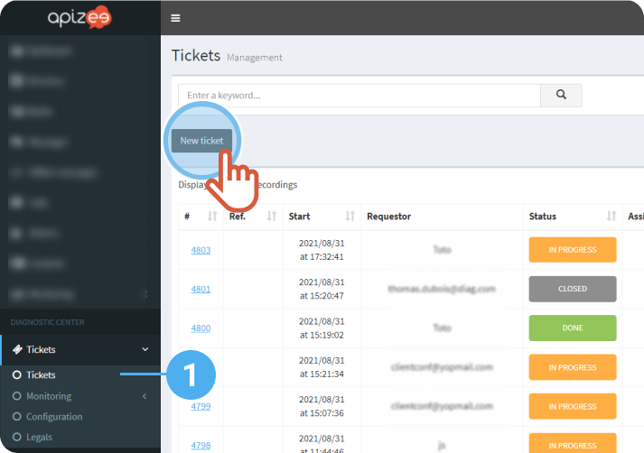
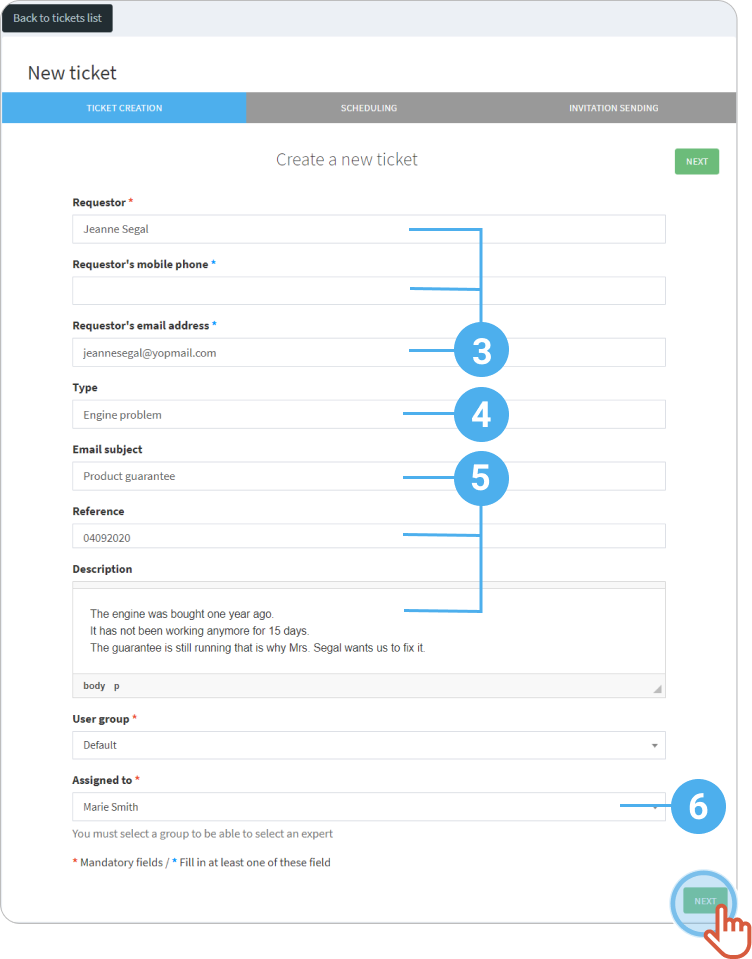
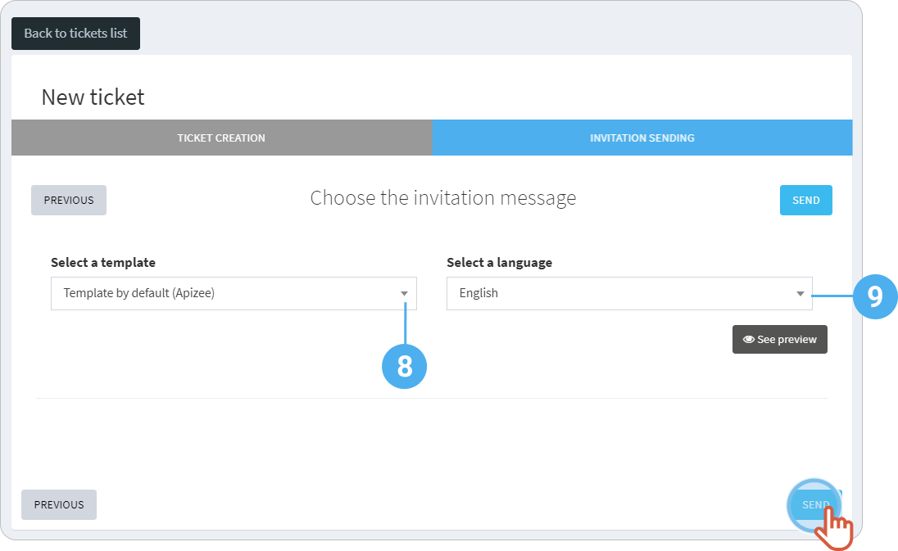

1. In the left-hand menu, click the service you want then, **Tickets**.
2. Click **New ticket**. 
 
 
3. Fill in the requester information: name, phone number and/or email address.
4. Enter the type of request.
5. Enter the email subject, the ticket reference and describe the reason of the request.
6. Click the **Assigned to** drop-down menu to choose the person that will be in charge of the ticket.
7. Click **Next**. 
 
  

    

    The ticket is automatically assigned to the agent that creates it (When a supervisor creates a ticket, the supervisor has to choose who will be in charge of the ticket).

    
8. Choose an invitation **template**. 
If you did not create a template, choose **Template by default (Apizee)**.
9. Choose a language.
10. Click **Send**. 
 
 


The ticket is created and an invitation is sent to the requester.


* * *

**Watch the tutorial**

[More tutorials](../../tutorials.md)
