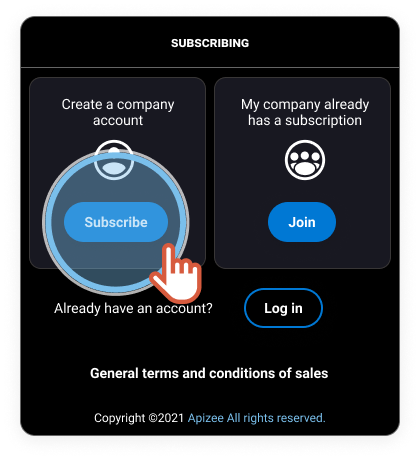
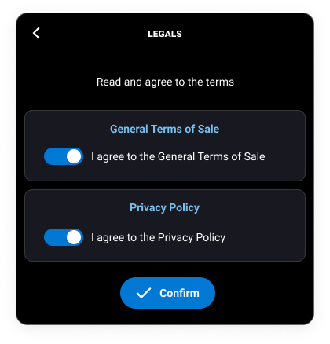
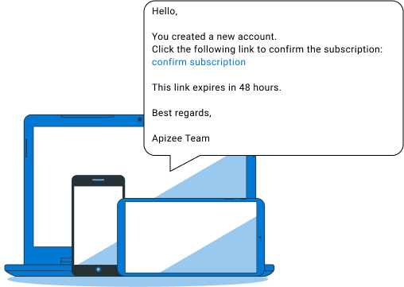
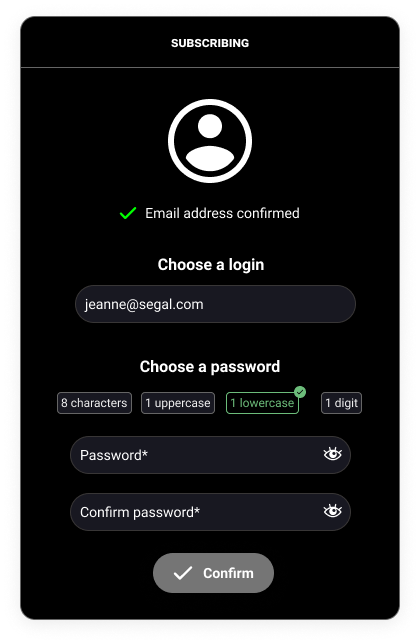
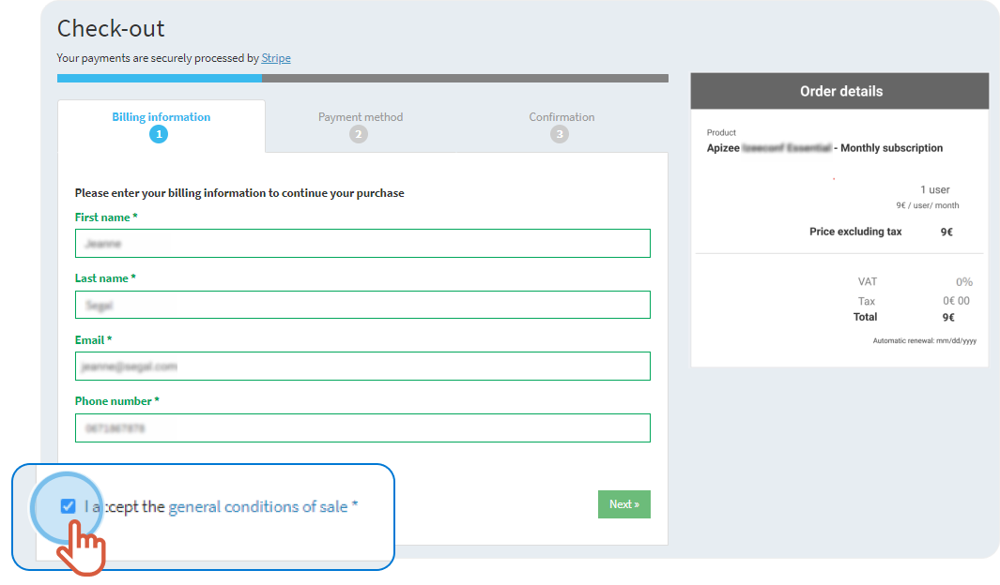
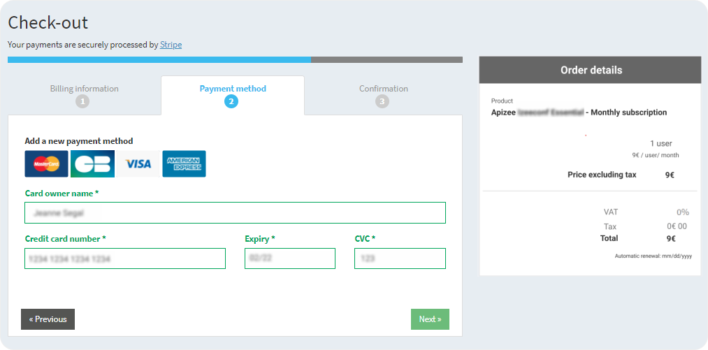
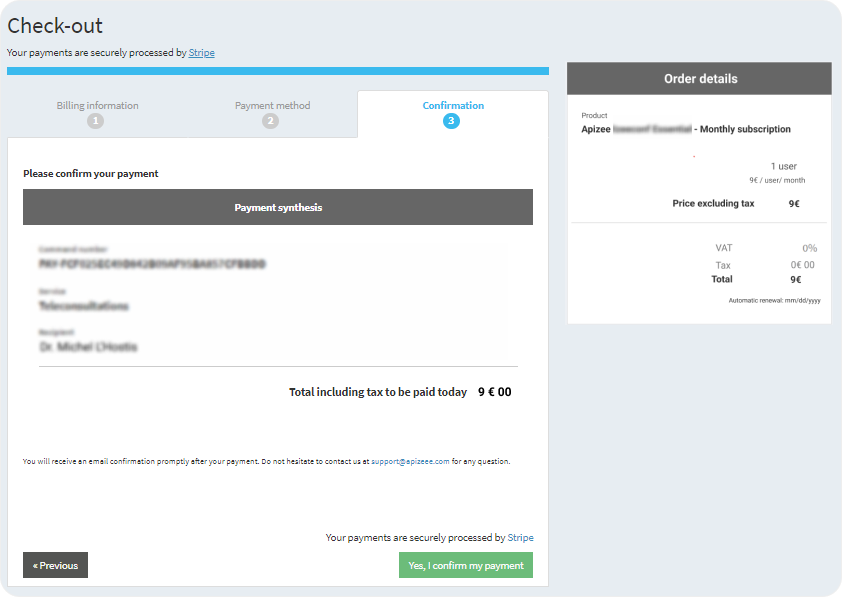


If you are interested in the **Diag Help Desk** solution, please [contact our Sales team](https://www.apizee.com/contact-us/) first, to make sure you have a subscription before you create a new account.



From the [Apizee Pricing page](https://www.apizee.com/solutions-pricing/), click **Read more** under the solution you are interested in.


1. Click **Subscribe** under the offer you want.
2. If your company does not have an account yet, click **Subscribe**. 
 
 
3. Click the **switch** to accept the Terms and the Policy then, click **Confirm**. 
 
 
4. Enter your **Last name**, **first name** and **email address**.
5. Tick the box **I am not a robot** then, click **Confirm**. 
 
 


The subscription is saved. You will receive a message.

6. Click **I understand**. 
 
 
7. In the message, click the link. 
 
 
8. Enter your new password twice and click **Confirm**. 
 
 


You are logged in to your account.

9. Choose the type of subscription you want then, click **Confirm**. 


The payment process starts.

10. Enter your information, tick the box **I accept the general condition of sale** and click **Next**. 
 
 
11. Enter your bank account information and click **Next**.​ 
 
 
12. Check the information and click **Yes, I confirm my payment**. 
 
 


The payment is completed.

    |  | You can follow up the invoices and check the renewals: 
On the left-hand menu, click **Company**then, click **Invoices**. |
    | --- | --- |
